# Wildberries API TypeScript SDK Architecture Document

**Document Version**: 1.0 | **Date**: 2025-10-19 | **Status**: Final

---

## Introduction

This document outlines the overall project architecture for **Wildberries API TypeScript SDK**, including backend systems, shared services, and non-UI specific concerns. Its primary goal is to serve as the guiding architectural blueprint for AI-driven development, ensuring consistency and adherence to chosen patterns and technologies.

**Relationship to Frontend Architecture:**
This is a **TypeScript library/SDK project** with no UI components. This document serves as the complete architectural specification for the SDK's internal structure, code generation framework, HTTP client infrastructure, and developer experience design.

### Starter Template or Existing Project

**Analysis:** This is a **greenfield TypeScript SDK project** with no starter template.

**Project Foundation:**
- **TypeScript 5.x** with strict mode
- **Node.js LTS** (18.x, 20.x, 22.x)
- **Vite** for build tooling (dual ESM/CommonJS output)
- **Vitest** for testing
- **Custom code generator** (`tools/generate-sdk.ts`) to transform 11 OpenAPI specifications

**Decision: No Starter Template**

For TypeScript SDK/library projects, building from scratch provides:
- **Unique Requirements:** Code generation from OpenAPI specs is highly specialized - no template covers this pattern
- **Bundle Optimization:** Custom Vite configuration needed for tree-shakeable dual builds
- **Type System Design:** Complex generic types and type generation require custom architecture
- **Minimal Dependencies:** SDK projects need lean dependency trees - starters add bloat

**Approach:**
- Initialize with `npm init` and configure TypeScript/Vite manually
- Build custom code generator tailored to Wildberries API structure
- Maximum control over bundle size and type safety

### Change Log

| Date | Version | Description | Author |
|------|---------|-------------|--------|
| 2025-10-19 | 1.0 | Initial architecture document from PRD | Winston (Architect Agent) |

---

## High Level Architecture

### Technical Summary

The Wildberries API TypeScript SDK employs a **layered library architecture** with automated code generation at its core. The system transforms 11 OpenAPI 3.0.1 specifications into production-ready TypeScript modules using a custom generator, while providing centralized HTTP infrastructure through a shared BaseClient. The architecture prioritizes **type safety** (TypeScript strict mode), **developer experience** (full IDE autocomplete), **reliability** (automatic retry with exponential backoff), and **bundle efficiency** (tree-shakeable modules <100KB gzipped). Core architectural patterns include code generation, dependency injection, interceptor-based middleware, and token bucket rate limiting, all supporting the PRD goal of reducing integration time from weeks to hours while maintaining zero critical security vulnerabilities.

### High Level Overview

**Architectural Style:** **Modular Library Architecture with Code Generation**

**Repository Structure:** **Monorepo** (single npm package: `daytona-wildberries-typescript-sdk`)
- Rationale: Single package simplifies dependency management and enables atomic releases while tree-shaking ensures consumers only bundle used modules

**Service Architecture:** **TypeScript SDK Library** with 4-layer design:

1. **Core Infrastructure Layer**
   - `BaseClient`: Axios-based HTTP client with auth, timeout, error transformation
   - `RateLimiter`: Token bucket algorithm enforcing per-endpoint rate limits
   - `RetryHandler`: Exponential backoff retry logic for transient failures
   - `AuthManager`: API key validation and header injection

2. **Generated Type Layer**
   - TypeScript interfaces auto-generated from OpenAPI `components.schemas`
   - Request/response type pairs per endpoint
   - Enum types for API values (OrderStatus, ReportType, etc.)
   - Generic utility types for pagination, filters, date ranges

3. **API Module Layer** (11 modules)
   - Each module delegates to BaseClient
   - Typed methods generated from OpenAPI `paths`
   - Module-specific rate limit configuration
   - Independent imports for tree-shaking

4. **SDK Aggregator Layer**
   - `WildberriesSDK` class exposing all modules as properties
   - Single configuration object shared across modules
   - Unified error handling and logging

**Primary User Interaction Flow:**

```
Developer → WildberriesSDK({ apiKey })
    → sdk.products.createProduct(data)
        → ProductsModule.createProduct()
            → RateLimiter.waitForSlot('products.create')
                → BaseClient.post() [with auth header, timeout, retry]
                    → RetryHandler.executeWithRetry()
                        → Axios HTTP request
                            ← API Response
                        ← Transform to ProductResponse type
                    ← Return typed response or throw typed error
```

**Key Architectural Decisions:**

1. **Code Generation over Manual Implementation**
   - Rationale: 11 APIs with 100+ endpoints impossible to maintain manually; OpenAPI as single source of truth prevents drift

2. **Shared BaseClient with Dependency Injection**
   - Rationale: Consistent error handling, auth, and retry logic across all modules

3. **Token Bucket Rate Limiting**
   - Rationale: Prevents API bans by enforcing limits extracted from Swagger descriptions

4. **Dual Build (ESM + CommonJS)**
   - Rationale: Maximum compatibility with Node.js projects

5. **Zero Runtime Dependencies (except Axios)**
   - Rationale: Minimizes security surface area and bundle size

### High Level Project Diagram

```mermaid
graph TB
    subgraph "Developer Application"
        DEV[Developer Code]
    end

    subgraph "Wildberries SDK - Public API"
        SDK[WildberriesSDK Class]
        SDK --> GEN[GeneralModule]
        SDK --> PROD[ProductsModule]
        SDK --> OFBS[OrdersFBSModule]
        SDK --> OFBW[OrdersFBWModule]
        SDK --> FIN[FinancesModule]
        SDK --> ANAL[AnalyticsModule]
        SDK --> REP[ReportsModule]
        SDK --> COMM[CommunicationsModule]
        SDK --> PROM[PromotionModule]
        SDK --> TAR[TariffsModule]
        SDK --> ISP[InStorePickupModule]
    end

    subgraph "Core Infrastructure Layer"
        BC[BaseClient<br/>HTTP + Auth + Errors]
        RL[RateLimiter<br/>Token Bucket]
        RH[RetryHandler<br/>Exponential Backoff]
        AM[AuthManager<br/>API Key]
    end

    subgraph "Code Generation System"
        GEN_TOOL[tools/generate-sdk.ts]
        SWAGGER[11 OpenAPI YAML Files]
        TYPE_GEN[Type Generator]
        MODULE_GEN[Module Generator]
        RATE_GEN[Rate Limit Parser]
    end

    subgraph "External Wildberries APIs"
        API_COMMON[common-api.wildberries.ru]
        API_CONTENT[content-api.wildberries.ru]
        API_MARKET[marketplace-api.wildberries.ru]
        API_ANALYTICS[seller-analytics-api.wildberries.ru]
        API_FINANCE[finance-api.wildberries.ru]
        API_STATS[statistics-api.wildberries.ru]
    end

    DEV --> SDK
    GEN --> BC
    PROD --> BC
    OFBS --> BC
    OFBW --> BC
    FIN --> BC
    ANAL --> BC
    REP --> BC
    COMM --> BC
    PROM --> BC
    TAR --> BC
    ISP --> BC

    BC --> RL
    BC --> RH
    BC --> AM
    BC --> ERRORS[Error Classes]

    BC --> API_COMMON
    BC --> API_CONTENT
    BC --> API_MARKET
    BC --> API_ANALYTICS
    BC --> API_FINANCE
    BC --> API_STATS

    SWAGGER --> GEN_TOOL
    GEN_TOOL --> TYPE_GEN
    GEN_TOOL --> MODULE_GEN
    GEN_TOOL --> RATE_GEN
    TYPE_GEN -.generates.-> PROD
    MODULE_GEN -.generates.-> PROD
    RATE_GEN -.generates.-> RL

    style SDK fill:#4CAF50
    style BC fill:#2196F3
    style GEN_TOOL fill:#FF9800
```



### Architectural and Design Patterns

#### Pattern 1: Code Generation Strategy
- **Recommendation:** Custom Generator
- **Description:** Bespoke tool using js-yaml and TypeScript AST for transforming OpenAPI → TypeScript
- **Rationale:** Wildberries APIs have unique patterns (Russian rate limit tables, multi-domain URLs). Full control over type mapping, JSDoc extraction, and rate limit parsing.

#### Pattern 2: Module Organization Pattern
- **Recommendation:** Facade Pattern with Delegation
- **Description:** Modules delegate to shared BaseClient
- **Rationale:** Clean separation, testability, consistency across all modules

#### Pattern 3: Rate Limiting Strategy
- **Recommendation:** Token Bucket Algorithm
- **Description:** Track tokens per endpoint with refill rate
- **Rationale:** Handles burst limits naturally, aligns with Wildberries API rate limit format

#### Pattern 4: Error Handling Pattern
- **Recommendation:** Typed Error Hierarchy
- **Description:** Custom error classes extending Error (WBAPIError, AuthenticationError, RateLimitError, ValidationError, NetworkError)
- **Rationale:** TypeScript-native with `instanceof` checks, rich context, preserves stack traces

#### Pattern 5: HTTP Client Pattern
- **Recommendation:** Interceptor Pattern with Axios
- **Description:** Request/response interceptors for auth/logging/retry
- **Rationale:** Battle-tested, mature ecosystem, excellent TypeScript support

#### Pattern 6: Configuration Management
- **Recommendation:** Constructor Injection with Environment Fallback
- **Description:** Pass SDKConfig object to constructor, fallback to process.env
- **Rationale:** Explicit, testable, flexible, type-safe

#### Pattern 7: Type Generation Strategy
- **Recommendation:** Schema-First with Mapped Types
- **Description:** OpenAPI schemas → TypeScript interfaces
- **Rationale:** Single source of truth, automatic updates, guarantees 100% API coverage

#### Pattern 8: Testing Strategy
- **Recommendation:** MSW for Integration + Vitest Mocks for Unit
- **Description:** MSW intercepts HTTP at network level, Vitest mocks for fast unit tests
- **Rationale:** Realistic HTTP flow validation, reusable handlers, fast isolated testing

---

## Tech Stack

### Cloud Infrastructure

**N/A - This is a TypeScript SDK library**

Supporting infrastructure:
- **Package Registry:** npm (public registry)
- **Documentation Hosting:** GitHub Pages (static site hosting)
- **Repository:** GitHub (public, open-source)
- **CI/CD:** GitHub Actions (cloud-hosted runners)

### Technology Stack Table

| **Category** | **Technology** | **Version** | **Purpose** | **Rationale** |
|--------------|----------------|-------------|-------------|---------------|
| **Language** | TypeScript | 5.3.3 | Primary development language | Strong typing eliminates runtime errors, excellent IDE support, strict mode enforces type safety |
| **Runtime** | Node.js | 20.11.1 LTS | JavaScript runtime environment | LTS version ensures stability. Multi-version support (18, 20, 22) covers 95% of users |
| **Module System** | ESM + CommonJS | Dual build | Module formats | ESM for modern projects (tree-shaking), CommonJS for legacy compatibility |
| **Build Tool** | Vite | 5.0.12 | Fast builds & optimization | 10-100x faster than Webpack, native ESM, optimal code splitting, meets <30s build requirement |
| **HTTP Client** | Axios | 1.6.7 | HTTP request library | Mature interceptor architecture, excellent TypeScript support, 100M+ weekly downloads |
| **Code Generation** | Custom Generator | N/A | Transform OpenAPI → TypeScript | Bespoke tool for Wildberries-specific patterns (rate limits, multi-domain URLs) |
| **YAML Parser** | js-yaml | 4.1.0 | Parse OpenAPI specs | Industry standard for YAML parsing, required for code generator |
| **Test Framework** | Vitest | 1.2.2 | Unit & integration testing | TypeScript-native, Vite-compatible, 10x faster than Jest, built-in coverage |
| **HTTP Mocking** | MSW | 2.1.2 | Integration test mocking | Intercepts network requests at fetch/Axios level, realistic HTTP testing |
| **Linting** | ESLint | 8.56.0 | Code quality enforcement | TypeScript-specific rules, no-any enforcement, catches common mistakes |
| **Formatting** | Prettier | 3.2.4 | Code style consistency | Zero-config, integrates with ESLint, ensures uniform code style |
| **Documentation** | TypeDoc | 0.25.7 | API reference generation | TypeScript-native, converts JSDoc → static site, validates 100% coverage |
| **CI/CD** | GitHub Actions | N/A | Automated testing & publishing | Free for public repos, matrix testing, automated npm publishing |
| **Package Manager** | npm | 10.x | Dependency management | Default Node.js package manager, native to npm registry |
| **Version Control** | Git + GitHub | N/A | Source control | Industry standard, GitHub integrations (Actions, Pages, Releases) |
| **License** | MIT | N/A | Open source license | Permissive license encouraging adoption |

### Development-Time Tools

| **Category** | **Technology** | **Version** | **Purpose** | **Rationale** |
|--------------|----------------|-------------|-------------|---------------|
| **MCP Integration** | Context7 MCP Server | N/A | Library documentation lookup | **MANDATORY** for retrieving up-to-date patterns. Development-time only, NOT runtime dependency |
| **Code Coverage** | c8 (via Vitest) | Built-in | Test coverage reporting | Native Vitest integration, validates ≥90% core, ≥80% module coverage |
| **Bundle Analyzer** | rollup-plugin-visualizer | 5.12.0 | Bundle size analysis | Validates <100KB gzipped, visualizes tree-shaking effectiveness |
| **Type Checker** | tsc | 5.3.3 | Type validation | Standalone type checking, runs in CI, ensures strict mode compliance |

### Dependency Philosophy

**Runtime Dependencies:** MINIMAL (Axios only)
- Every dependency increases security surface area and bundle size

**Development Dependencies:** SELECTIVE (Build/test tools only)
- Dev dependencies don't affect bundle size

**Security Policy:**
- npm audit runs in CI on every commit
- Automated Dependabot updates for security patches
- Zero tolerance for high/critical vulnerabilities

---

## Data Models

Core TypeScript interfaces representing Wildberries API entities, auto-generated from OpenAPI schemas.

### Model 1: ProductCard

**Purpose:** Product listing in Wildberries marketplace catalog

**Key Attributes:**
- `id: string` - Unique product identifier
- `brandName: string` - Product brand (required)
- `categoryId: string` - Category classification
- `title: string` - Product display name
- `description: string` - Product description
- `characteristics: Characteristic[]` - Product attributes (size, color, material)
- `mediaUrls: string[]` - Product image URLs
- `pricing: PricingInfo` - Current price and discount
- `stock: StockInfo[]` - Inventory levels per warehouse
- `status: ProductStatus` - Enum: 'active' | 'draft' | 'archived'
- `createdAt: string` - ISO 8601 timestamp
- `updatedAt: string` - ISO 8601 timestamp

**Relationships:**
- Belongs to Category (many-to-one)
- Has many Characteristics (one-to-many)
- Has many StockInfo entries (one-to-many)
- Referenced by Orders (many-to-many)

### Model 2: Order

**Purpose:** Customer purchase order requiring fulfillment

**Key Attributes:**
- `orderId: string` - Unique order identifier
- `type: OrderType` - Enum: 'FBS' | 'FBW'
- `status: OrderStatus` - Enum: 'new' | 'confirmed' | 'assembled' | 'shipped' | 'delivered' | 'cancelled'
- `items: OrderItem[]` - Ordered products with quantities
- `totalAmount: number` - Total order value in rubles
- `customerInfo: CustomerInfo` - Delivery address and contact
- `shippingInfo?: ShippingInfo` - Tracking number, carrier, label URL (FBS)
- `warehouseId?: string` - Warehouse assignment (FBW)
- `createdAt: string` - Order creation timestamp
- `deliveryDeadline: string` - Required delivery date

**Relationships:**
- Has many OrderItems (one-to-many)
- References ProductCard via OrderItem (many-to-many)
- May have ShippingInfo (one-to-one, FBS only)
- May have Return (one-to-one)

### Model 3: Category

**Purpose:** Product taxonomy node for marketplace organization

**Key Attributes:**
- `id: string` - Category identifier
- `name: string` - Category display name
- `parentId: string | null` - Parent category ID
- `level: number` - Hierarchy depth
- `requiredCharacteristics: CharacteristicDefinition[]` - Mandatory attributes
- `optionalCharacteristics: CharacteristicDefinition[]` - Optional attributes

**Relationships:**
- Has many Categories (tree structure)
- Has many ProductCards (one-to-many)
- Defines CharacteristicDefinitions (one-to-many)

### Model 4: Transaction

**Purpose:** Financial record of money movement in seller account

**Key Attributes:**
- `transactionId: string` - Unique identifier
- `type: TransactionType` - Enum: 'sale' | 'refund' | 'commission_fee' | 'payout'
- `amount: number` - Amount in rubles
- `currency: string` - Always 'RUB'
- `orderId?: string` - Related order ID
- `description: string` - Human-readable description
- `balanceAfter: number` - Account balance after transaction
- `timestamp: string` - ISO 8601 timestamp

**Relationships:**
- May reference Order (many-to-one)
- Belongs to Balance (many-to-one)

### Model 5: SalesFunnel

**Purpose:** Conversion analytics from product view to purchase

**Key Attributes:**
- `productId: string` - Product being analyzed
- `dateRange: DateRange` - Analysis period
- `views: number` - Total product page views
- `addToCarts: number` - Items added to cart
- `purchases: number` - Completed purchases
- `conversionRate: number` - Purchases / views percentage
- `revenue: number` - Total revenue generated
- `averageOrderValue: number` - Revenue / purchases
- `returnRate: number` - Percentage of orders returned

**Relationships:**
- References ProductCard (many-to-one)
- Aggregated from Orders (derived data)

### Additional Models

- **Model 6: Chat** - Customer support conversation thread
- **Model 7: Campaign** - Promotional marketing campaign with discount rules
- **Model 8: Report** - Asynchronous report generation job and result

### Shared Value Objects

- `DateRange: { from: string; to: string }`
- `PaginationParams: { limit?: number; offset?: number }`
- `PaginatedResponse<T>: { data: T[]; total: number; hasMore: boolean }`
- `ApiResponse<T>: { data: T; cursor?: string; error?: null }`

---

## Components

Major logical components organized into 4 architectural layers.

### Component 1: WildberriesSDK (Main SDK Class)

**Responsibility:** Primary entry point, aggregates all 11 API modules

**Key Interfaces:**
```typescript
class WildberriesSDK {
  constructor(config: SDKConfig)
  readonly general: GeneralModule
  readonly products: ProductsModule
  readonly ordersFBS: OrdersFBSModule
  readonly ordersFBW: OrdersFBWModule
  readonly finances: FinancesModule
  readonly analytics: AnalyticsModule
  readonly reports: ReportsModule
  readonly communications: CommunicationsModule
  readonly promotion: PromotionModule
  readonly tariffs: TariffsModule
  readonly inStorePickup: InStorePickupModule
}
```

**Dependencies:** BaseClient, all 11 modules, AuthManager
**Technology Stack:** TypeScript 5.3.3 class with dependency injection
**Location:** `src/index.ts`

### Component 2: BaseClient (HTTP Infrastructure)

**Responsibility:** Centralized HTTP client with auth, timeouts, error transformation

**Key Interfaces:**
```typescript
class BaseClient {
  get<T>(url: string, options?: RequestOptions): Promise<T>
  post<T>(url: string, data?: unknown, options?: RequestOptions): Promise<T>
  put<T>(url: string, data?: unknown, options?: RequestOptions): Promise<T>
  patch<T>(url: string, data?: unknown, options?: RequestOptions): Promise<T>
  delete<T>(url: string, options?: RequestOptions): Promise<T>
}
```

**Dependencies:** Axios, RateLimiter, RetryHandler, AuthManager, Error classes
**Technology Stack:** Axios instance with interceptors, generic TypeScript methods
**Location:** `src/client/base-client.ts`

### Component 3: RateLimiter (Rate Limit Enforcement)

**Responsibility:** Token bucket algorithm for per-endpoint rate limits

**Key Interfaces:**
```typescript
class RateLimiter {
  async waitForSlot(key: string): Promise<void>
  canProceed(key: string): boolean
  consumeToken(key: string): void
}
```

**Dependencies:** None (pure in-memory state)
**Technology Stack:** Token bucket algorithm, async queue using Promises
**Location:** `src/client/rate-limiter.ts`

### Component 4: RetryHandler (Retry Logic)

**Responsibility:** Exponential backoff retry for transient failures

**Key Interfaces:**
```typescript
class RetryHandler {
  async executeWithRetry<T>(operation: () => Promise<T>, context: RetryContext): Promise<T>
}
```

**Dependencies:** Error classes
**Technology Stack:** Generic async wrapper, exponential backoff formula
**Location:** `src/client/retry-handler.ts`

### Component 5: AuthManager (Authentication)

**Responsibility:** API key validation and authentication header injection

**Key Interfaces:**
```typescript
class AuthManager {
  validate(): void
  getAuthHeader(): { Authorization: string }
}
```

**Dependencies:** AuthenticationError
**Technology Stack:** Simple validation, header format
**Location:** `src/client/auth-manager.ts`

### Component 6-16: API Modules (11 Modules)

**Pattern:** Each module follows identical structure - delegate to BaseClient with typed request/response

**Modules:**
1. GeneralModule - Ping, news, seller info
2. ProductsModule - Categories, products, media, pricing, stock
3. OrdersFBSModule - Seller fulfillment orders, shipping labels
4. OrdersFBWModule - WB fulfillment, supplies, returns
5. FinancesModule - Balance, transactions, reports, payouts
6. AnalyticsModule - Sales funnel, performance, CSV exports
7. ReportsModule - Async report generation
8. CommunicationsModule - Chat, Q&A, reviews
9. PromotionModule - Campaigns, promo codes, advertising
10. TariffsModule - Commission rates, fees
11. InStorePickupModule - Pickup points, orders

**Location:** `src/modules/[module]/`

### Component 17: Error Classes

**Hierarchy:**
- WBAPIError (base)
- AuthenticationError (401, 403)
- RateLimitError (429)
- ValidationError (400, 422)
- NetworkError (timeouts, 5xx)

**Location:** `src/errors/`

### Component 18: Type Definitions

**Auto-generated TypeScript interfaces** from OpenAPI schemas
**Location:** `src/types/`

### Component 19: Code Generator

**Build-time tool** for transforming OpenAPI → TypeScript
**Location:** `tools/generate-sdk.ts`

---

## External APIs

This SDK integrates with 11 Wildberries API domains.

### Common Integration Patterns

**Authentication:** All APIs use `Authorization: Bearer {api_key}`
**Rate Limiting:** Per-endpoint limits vary (1 req/10s to 10 req/min)
**Error Responses:** HTTP status codes + JSON error bodies
**Date Formats:** ISO 8601 strings with timezone
**Pagination:** Mix of offset/limit and cursor-based
**Async Operations:** Reports use poll-for-completion pattern

### Wildberries Content API

**Purpose:** Product catalog management
**Base URL:** `https://content-api.wildberries.ru`
**Rate Limits:** STRICT - 1 req/10s for product creation, 3 req/min for categories
**Key Endpoints:** Product CRUD, categories, media upload, pricing, stock

### Wildberries Marketplace API

**Purpose:** Order management (FBS and FBW)
**Base URL:** `https://marketplace-api.wildberries.ru`
**Rate Limits:** 5 req/min for orders, 10 req/min for status updates
**Key Endpoints:** Order retrieval, status updates, shipping labels, returns

### Wildberries Finance API

**Purpose:** Account balance and financial reporting
**Base URL:** `https://finance-api.wildberries.ru`
**Rate Limits:** 10 req/min for balance, 5 req/min for transactions
**Key Endpoints:** Balance, transactions, reports, payouts

### Wildberries Analytics API

**Purpose:** Sales performance analytics
**Base URL:** `https://seller-analytics-api.wildberries.ru`
**Rate Limits:** 5 req/min for queries, 1 req/2min for CSV exports
**Key Endpoints:** Sales funnel, product performance, search queries, CSV exports

### Additional APIs

- **Common API:** General utilities (ping, news, seller info)
- **Statistics API:** Extended financial/operational statistics
- **Communications API:** Chat, Q&A, reviews
- **Promotion API:** Marketing campaigns and advertising
- **Tariffs API:** Commission rates and fees
- **In-Store Pickup API:** Pickup point management
- **Reports API:** Generic async report generation

### SDK Integration Strategy

- BaseClient handles all domains via configurable baseUrls map
- Rate limits extracted from Swagger during code generation
- Retry logic applies uniformly (5xx, 429, network errors)
- Error transformation maps status codes to typed errors
- No external API client libraries required (Axios sufficient)

---

## Core Workflows

Critical user journeys demonstrating component collaboration.

### Workflow 1: SDK Initialization and First API Call

Shows complete initialization flow demonstrating <30 minute time-to-first-call goal.

**Flow:** Developer creates SDK → Auth validation → Module initialization → Ping endpoint call → Success

### Workflow 2: Product Creation with Rate Limiting and Retry

Demonstrates strict rate limit enforcement (1 req/10s) and retry logic for transient failures.

**Flow:** First request (immediate) → Second request (queued 10s) → Transient 500 error → Retry succeeds

### Workflow 3: Order Fulfillment (FBS) - Happy Path

Multi-step business workflow across multiple endpoints.

**Flow:** Fetch orders → Confirm order → Generate shipping label → Update tracking → Mark shipped

### Workflow 4: Error Handling Flow

How different error scenarios are handled and surfaced.

**Scenarios:**
- Authentication error (401) → AuthenticationError
- Validation error (400) → ValidationError with field errors
- Rate limit error (429) → Automatic retry with delay
- Network timeout → Retry with exponential backoff

### Workflow 5: Async Report Generation

Async operation pattern for long-running reports.

**Flow:** Request report → Poll status (pending/processing) → Download completed report

---

## Source Tree

```
wb-api-sdk/
├── .github/workflows/          # CI/CD pipelines
├── docs/                       # Documentation
│   ├── prd.md
│   ├── architecture.md
│   └── api-reference/          # Generated TypeDoc
├── examples/                   # Usage examples
│   ├── quickstart.ts
│   ├── products-crud.ts
│   └── [module].ts
├── src/                        # TypeScript source
│   ├── index.ts                # Main SDK export
│   ├── client/                 # Core infrastructure
│   │   ├── base-client.ts
│   │   ├── rate-limiter.ts
│   │   ├── retry-handler.ts
│   │   └── auth-manager.ts
│   ├── modules/                # 11 API modules (GENERATED)
│   │   ├── general/
│   │   ├── products/
│   │   ├── orders-fbs/
│   │   └── [module]/
│   ├── types/                  # Type definitions (GENERATED)
│   │   ├── general.types.ts
│   │   ├── products.types.ts
│   │   └── [module].types.ts
│   ├── errors/                 # Error hierarchy
│   │   ├── base-error.ts
│   │   ├── auth-error.ts
│   │   └── [error].ts
│   ├── config/                 # Configuration
│   └── utils/                  # Utilities
├── tools/                      # Code generation
│   ├── generate-sdk.ts
│   └── generators/
├── tests/                      # Test suites
│   ├── unit/
│   ├── integration/
│   └── fixtures/
├── wildberries_api_doc/        # Source OpenAPI specs
│   ├── 01-general.yaml
│   └── [module].yaml
├── dist/                       # Build output (NOT committed)
│   ├── esm/
│   └── cjs/
├── package.json
├── tsconfig.json
├── vite.config.ts
└── vitest.config.ts
```

**Key Directories:**
- `src/client/` - Hand-written core infrastructure
- `src/modules/` - Auto-generated API modules
- `src/types/` - Auto-generated TypeScript interfaces
- `tools/` - Build-time code generator (NOT in bundle)
- `wildberries_api_doc/` - Source of truth (DO NOT MODIFY)

---

## Infrastructure and Deployment

### Infrastructure as Code

**Tool:** GitHub Actions (YAML configuration)
**Location:** `.github/workflows/`
**Approach:** Declarative workflow definitions

**N/A for Cloud Infrastructure:** SDK is npm library, not cloud service

### Deployment Strategy

**Strategy:** Continuous Delivery with Tag-Based Releases
**CI/CD Platform:** GitHub Actions

**Workflow:**
1. Developer pushes code → CI pipeline runs (test, lint, build)
2. Developer creates git tag (v1.0.0) → Release pipeline triggers
3. Release pipeline: Build → Publish to npm → Deploy docs to GitHub Pages → Create GitHub Release

### CI Pipeline

**Triggers:** Push to main, pull requests
**Jobs:**
- Install dependencies
- Lint (ESLint)
- Type check (tsc --noEmit)
- Run tests (unit + integration)
- Generate coverage report
- Build SDK
- Bundle size check
- Matrix test: Node.js 18.x, 20.x, 22.x

**Performance Target:** <5 minutes execution

### Release Pipeline

**Triggers:** Git tag push (v*)
**Jobs:**
- Run full CI pipeline
- Generate SDK from Swagger
- Build production bundle
- Validate bundle size (<100KB)
- Publish to npm
- Generate and deploy TypeDoc
- Create GitHub Release

### Environments

1. **Development:** Local developer workstations
2. **CI:** GitHub Actions runners (Ubuntu)
3. **Production:** npm registry + GitHub Pages

### Rollback Strategy

**Primary Method:** npm deprecation + version pin

**Trigger Conditions:**
- Security vulnerability (CVSS ≥7.0)
- Breaking changes not documented
- Build errors reported by >3 users within 24h
- Bundle size regression >20%

**Recovery Time Objective:** <2 hours

### Secrets Management

**Development:** `.env.local` file (gitignored)
**CI/CD:** GitHub Secrets (NPM_TOKEN, CODECOV_TOKEN)
**Production:** Developer provides API key via SDKConfig

---

## Error Handling Strategy

### General Approach

**Error Model:** Typed Error Hierarchy with Rich Context

**Exception Hierarchy:**
```
Error (native)
  └── WBAPIError (base SDK error)
        ├── AuthenticationError (401, 403)
        ├── RateLimitError (429)
        ├── ValidationError (400, 422)
        └── NetworkError (timeouts, 5xx)
```

**Error Propagation:** Fail-fast with typed exceptions

### Error Class Specifications

**WBAPIError (Base):**
- Properties: message, statusCode, response, requestId
- Method: getUserMessage() - Human-readable with recovery guidance

**AuthenticationError:**
- Thrown on: 401, 403, invalid API key validation
- Recovery: Verify API key, check permissions

**RateLimitError:**
- Thrown on: 429 Too Many Requests
- Property: retryAfter (milliseconds)
- Recovery: SDK automatically retries with delay

**ValidationError:**
- Thrown on: 400, 422 validation failures
- Property: fieldErrors (field → error message map)
- Recovery: Check field-level errors, fix request data

**NetworkError:**
- Thrown on: Timeouts, connection failures, 5xx errors
- Property: cause (original error), isTimeout (boolean)
- Recovery: SDK automatically retries (max 3 attempts)

### Logging Standards

**Library:** Custom lightweight logger (no external dependency)
**Format:** Structured JSON
**Levels:** debug, info, warn, error

**Required Context:**
- Correlation ID (UUID v4 per request)
- Service context (service: 'WildberriesSDK', version)
- User context (module, method, endpoint)

**Logging Rules:**
- ✅ Log: HTTP status, error messages (sanitized), request URLs, correlation IDs
- ❌ NEVER log: API keys, tokens, PII, full request/response bodies

**Default:** warn level in production, debug in development

### Error Handling Patterns

**External API Errors:**
- Retry policy: 429, 500, 502, 503, 504 (max 3 retries)
- Timeout: 30 seconds default
- Error transformation: Axios errors → Typed SDK errors

**Business Logic Errors:**
- Validation errors for client-side failures
- Type errors caught at compile-time

**Developer Guidelines:**
```typescript
try {
  await sdk.products.createProduct(data);
} catch (error) {
  if (error instanceof AuthenticationError) { /* Handle auth */ }
  if (error instanceof ValidationError) { /* Handle validation */ }
  if (error instanceof RateLimitError) { /* Already retried */ }
  if (error instanceof NetworkError) { /* Network issue */ }
}
```

---

## Coding Standards

**⚠️ CRITICAL: These standards directly control AI agent behavior**

### Core Standards

**Languages:** TypeScript 5.3.3 with strict mode
**Linting:** ESLint 8.56.0 with @typescript-eslint
**Formatting:** Prettier 3.2.4
**Testing:** Vitest 1.2.2

### Naming Conventions

| Element | Convention | Example |
|---------|-----------|---------|
| Classes | PascalCase | `BaseClient`, `ProductsModule` |
| Interfaces/Types | PascalCase | `SDKConfig`, `ProductCard` |
| Functions/Methods | camelCase | `createProduct()`, `waitForSlot()` |
| Variables | camelCase | `apiKey`, `retryDelay` |
| Constants | SCREAMING_SNAKE_CASE | `MAX_RETRIES`, `DEFAULT_TIMEOUT` |
| Files | kebab-case | `base-client.ts`, `products.types.ts` |
| Directories | kebab-case | `orders-fbs/`, `in-store-pickup/` |

### Critical Rules (MANDATORY)

1. **Zero `any` Types** - Never use `any` except controlled error handling
2. **All API Responses Use Generated Types** - Never manual type definitions
3. **No Direct Axios Usage in Modules** - Delegate to BaseClient only
4. **All Logging Must Use Logger Utility** - No console.log in src/
5. **Never Hardcode API Base URLs** - Use SDKConfig or OpenAPI servers
6. **All Public Methods Require JSDoc** - With @param, @returns, @throws, @example
7. **Errors Must Be Typed** - Never throw strings or plain objects
8. **Test Files Must Follow AAA Pattern** - Arrange, Act, Assert
9. **No Secrets in Code** - Use configuration or environment variables
10. **Generated Code Must Not Be Manually Modified** - Re-run generator instead

---

## Test Strategy and Standards

### Testing Philosophy

**Approach:** TDD for core infrastructure, test-after for generated modules

**Coverage Goals:**
- ≥90% for `src/client/` (core infrastructure)
- ≥80% for `src/modules/` (API modules)
- 100% for critical paths (auth, retry, rate limiting)

**Test Pyramid:**
- 70% Unit Tests - Fast, isolated
- 25% Integration Tests - MSW HTTP layer
- 5% E2E Tests - Optional real API validation

### Test Types

**Unit Tests (Vitest):**
- Location: `tests/unit/[component]/`
- Mock all dependencies
- Follow AAA pattern
- Coverage: ≥90% core, ≥80% modules

**Integration Tests (MSW):**
- Location: `tests/integration/`
- MSW intercepts HTTP at network level
- Validate request/response flow
- Test error transformation

**E2E Tests (Optional):**
- Real Wildberries sandbox API
- Manual execution only
- Before major releases

### Test Data Management

**Fixtures:** Static test data from OpenAPI examples
**Factories:** Generate test data with variations
**Cleanup:** N/A (SDK has no state)

### Continuous Testing

**CI Integration:**
- Run unit tests
- Run integration tests
- Generate coverage report
- Validate coverage thresholds (≥90% core, ≥80% modules)
- npm audit for security

**Performance Targets:**
- Unit tests: <2 seconds
- Integration tests: <3 seconds
- Full suite: <5 seconds

---

## Security

**MANDATORY security requirements enforced at all levels**

### Input Validation

**Validation Library:** TypeScript Type System + Runtime Validation
**Location:** API boundary (before HTTP request)

**Rules:**
1. All external inputs validated before API calls
2. Validation at API boundary before processing
3. Whitelist approach preferred

**Example:**
```typescript
if (!data.brandName || data.brandName.trim() === '') {
  throw new ValidationError('brandName is required');
}
```

### Authentication & Authorization

**Auth Method:** Bearer Token (API Key) via HTTP header

**Implementation:**
- API key validated on SDK initialization
- AuthManager provides `Authorization: Bearer {key}` header
- API key injected on every request

**Security:**
- Never log or expose API key
- Fail fast on invalid format
- Minimum 32 characters validation

### Secrets Management

**Development:** `.env.local` (gitignored)
**Production:** Environment variables or config management

**Rules:**
1. NEVER hardcode secrets
2. Access via configuration only
3. No secrets in logs or error messages

**Git Pre-Commit Hook:** Detect potential secrets before commit

### API Security

**Rate Limiting:** Token bucket algorithm via RateLimiter
**HTTPS Enforcement:** All requests must use HTTPS (HTTP rejected)
**Security Headers:** `Authorization`, `Content-Type`, `User-Agent`

**MANDATORY:** HTTPS only, no HTTP allowed

### Data Protection

**Encryption at Rest:** N/A (no persistent storage)
**Encryption in Transit:** TLS 1.2+ (HTTPS)

**PII Handling:**
1. Never log PII fields (names, addresses, emails)
2. Pass PII through without modification
3. Exclude PII from error messages

**Logging Restrictions:**
- ❌ NEVER log: API keys, tokens, PII, payment info, full bodies
- ✅ Safe to log: Status codes, error messages (sanitized), URLs, IDs, timestamps

### Dependency Security

**Scanning Tool:** npm audit (built-in)
**Update Policy:**
- Security patches: Apply within 24h
- Minor/patch: Weekly review (Dependabot)
- Major: Quarterly review

**CI Enforcement:**
```bash
npm audit --audit-level=high --production
```

**Lock File:** package-lock.json committed for reproducible builds

### Security Testing

**SAST Tool:** ESLint with security plugins
**DAST Tool:** N/A (library, not service)
**Penetration Testing:** Not required (no attack surface)

**CI Security:**
- ESLint security checks
- npm audit (production dependencies)
- Check for hardcoded secrets

**Vulnerability Disclosure:**
- Channel: GitHub Security Advisories
- Response: <72h critical, <7d high
- Patch: <48h for critical

### Security Checklist

- [ ] Validate all user inputs
- [ ] Never log API keys, tokens, or PII
- [ ] Use HTTPS for all requests
- [ ] Inject auth via AuthManager
- [ ] Sanitize error messages
- [ ] Use TypeScript strict mode
- [ ] Validate file uploads
- [ ] Apply rate limiting
- [ ] Run npm audit
- [ ] Test error scenarios
- [ ] Never hardcode secrets

---

## Next Steps

This architecture document is ready for implementation by development agents.

**Recommended Workflow:**

1. **Initialize Project Structure**
   - Create repository with folder structure from Source Tree section
   - Configure TypeScript, Vite, ESLint, Prettier
   - Set up GitHub Actions CI/CD pipelines

2. **Implement Core Infrastructure (Epic 1)**
   - BaseClient, RateLimiter, RetryHandler, AuthManager
   - Error hierarchy
   - TDD approach with unit tests

3. **Build Code Generator**
   - Type generator from OpenAPI schemas
   - Module generator from OpenAPI paths
   - Rate limit parser

4. **Generate and Implement Modules (Epics 2-4)**
   - Run code generator on all 11 Swagger files
   - Validate generated code
   - Add integration tests

5. **Documentation and Release**
   - Generate TypeDoc
   - Write examples
   - Publish v1.0 to npm

**Reference Documents:**
- PRD: `docs/prd.md` - Complete requirements
- OpenAPI Specs: `wildberries_api_doc/*.yaml` - API contracts
- CLAUDE.md: `.claude/CLAUDE.md` - Development guidelines

---

**Architecture Status:** ✅ Complete | Ready for Implementation
