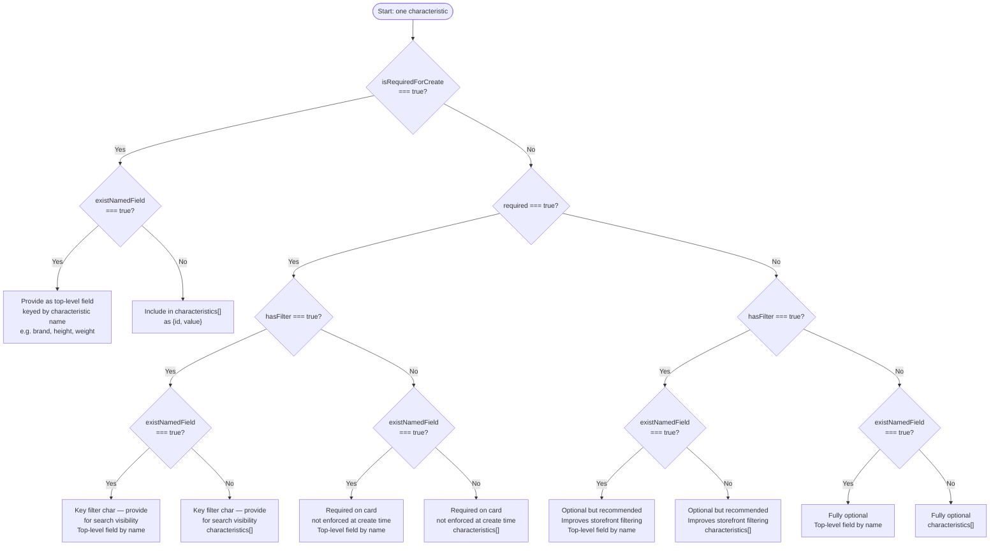

# Mandatory Product Characteristics

Starting **April 29, 2026**, Wildberries requires mandatory characteristics for product cards in select categories. Cards created without these characteristics will be rejected by the API.

## What Changed

The `GET /content/v2/object/charcs/{subjectId}` endpoint now returns an `isRequiredForCreate` boolean field. When `true`, the characteristic **must** be included in card creation and update requests.

The SDK added the `SubjectCharacteristic` interface (v3.9.0) with full type support for this field.

## Affected Categories

| Category | subjectId | Russian Name |
|----------|-----------|--------------|
| Flash Drives | 1260 | Флешки памяти |
| Fitness Bracelets | 1514 | Фитнес-браслеты |
| Hair Straighteners | 2314 | Выпрямители волос |
| Blenders | 614 | Блендеры |
| Nettops & Mini PCs | 8992 | Неттопы и Мини ПК |
| Photo Frames | 28 | Фоторамки |
| Calculators | 977 | Калькуляторы |
| Lids | 819 | Крышки |
| Pillowcases | 605 | Наволочки |
| Cleaning Wipes | 1202 | Салфетки для уборки |

::: tip
This list may expand over time. Always check `isRequiredForCreate` for your specific category before creating cards.
:::

## Routing Flag: `existNamedField`

Added in **v3.10.2** (WB API announcement 2026-05-06), `existNamedField` is a boolean on `SubjectCharacteristic` that controls **where** you place the characteristic's value in a card create/update request:

| `existNamedField` value | Where to place the value |
|------------------------|--------------------------|
| `false` or `undefined` | Inside the `characteristics[]` array as `{ id, value }` |
| `true` | As a **top-level field** on the card object, keyed by the characteristic's `name` |

### Known top-level fields

The following well-known characteristics have `existNamedField: true` across most categories:

| Characteristic name | Top-level field |
|--------------------|-----------------|
| `brand` | `data.brand` |
| `name` | `data.name` (product title) |
| `height` | `data.dimensions.height` / `data.height` |
| `length` | `data.dimensions.length` / `data.length` |
| `width` | `data.dimensions.width` / `data.width` |
| `weight` | `data.dimensions.weightGross` / `data.weight` |

::: tip
This list covers common examples but is **not exhaustive**. Always call `getCategoryCharacteristics()` (or `getObjectCharc(subjectId)`) for the authoritative per-category set and check each characteristic's `existNamedField` flag.
:::

### TypeScript routing example

```typescript
import { WildberriesSDK, validateRequiredCharacteristics } from 'daytona-wildberries-typescript-sdk';
import type { SubjectCharacteristic, CardCharacteristicInput } from 'daytona-wildberries-typescript-sdk';

const sdk = new WildberriesSDK({ apiKey: process.env.WB_API_KEY! });
const charcsResult = await sdk.products.getObjectCharc(1260);
const allChars: SubjectCharacteristic[] = charcsResult.data ?? [];

// Split by routing flag
const inlineChars = allChars.filter((c) => !c.existNamedField); // → characteristics[]
const namedChars = allChars.filter((c) => c.existNamedField === true); // → top-level fields

// Build characteristics[] for inline chars
const characteristics: CardCharacteristicInput[] = inlineChars.map((c) => ({
  id: c.charcID!,
  value: getValueForCharacteristic(c), // Your business logic
}));

// Build named-fields map for top-level chars
const namedFields: Record<string, unknown> = {};
for (const c of namedChars) {
  if (c.name) namedFields[c.name] = getValueForCharacteristic(c);
}

// Validate before submitting (v3.10.2+ call)
const missing = validateRequiredCharacteristics(allChars, characteristics, namedFields);
if (missing.length > 0) {
  throw new Error(`Missing required characteristics: ${missing.map((c) => c.name).join(', ')}`);
}

// Create the card — top-level named fields are spread alongside the characteristics array
// (exact top-level field path depends on your category's API contract)
const response = await sdk.products.createCardsUpload([{
  subjectID: 1260,
  variants: [{
    vendorCode: 'FLASH-USB-64GB',
    title: (namedFields['name'] as string | undefined) ?? '64GB USB Flash Drive',
    brand: (namedFields['brand'] as string | undefined) ?? '',
    characteristics,
    sizes: [{ techSize: 'one-size', wbSize: '', skus: ['1234567890123'] }],
  }],
}]);

function getValueForCharacteristic(c: SubjectCharacteristic): string | number | string[] {
  switch (c.charcType) {
    case 0: return 'text value';
    case 1: return 64;
    case 4: return ['value1'];
    default: return '';
  }
}
```

## Filter Flag: `hasFilter`

Also added in **v3.10.2**, `hasFilter` is a boolean on `SubjectCharacteristic` indicating that the characteristic is used as a **category filter on the Wildberries storefront** (the left-panel filter UI buyers use to narrow search results).

**Pairing rule**: when both `required: true` and `hasFilter: true`, the characteristic is a **key (filter) characteristic** — it must be provided for the card to appear in filtered search results in that category.

### Detecting filter-relevant mandatory characteristics

```typescript
import { WildberriesSDK } from 'daytona-wildberries-typescript-sdk';
import type { SubjectCharacteristic } from 'daytona-wildberries-typescript-sdk';

const sdk = new WildberriesSDK({ apiKey: process.env.WB_API_KEY! });
const charcsResult = await sdk.products.getObjectCharc(1260);
const allChars: SubjectCharacteristic[] = charcsResult.data ?? [];

// Key/filter mandatory characteristics — the most critical ones for search visibility
const keyFilterChars = allChars.filter(
  (c) => c.required === true && c.hasFilter === true
);

// Mandatory for creation but not a storefront filter
const createOnlyMandatory = allChars.filter(
  (c) => c.isRequiredForCreate === true && !c.hasFilter
);

console.log('Key filter chars (must provide for search visibility):');
for (const c of keyFilterChars) {
  console.log(`  - ${c.name} (existNamedField: ${c.existNamedField ?? false})`);
}
console.log('Create-only mandatory (no filter impact):');
for (const c of createOnlyMandatory) {
  console.log(`  - ${c.name}`);
}
```

## Obligation Matrix

The table below maps every combination of the four boolean flags on `SubjectCharacteristic` to the required action and the correct location in the API request. The branching matches `src/utils/validateRequiredCharacteristics.ts` exactly.

**Notation**: `false/undef` is shorthand for `false | undefined` in the cell values below. The SDK helper treats both equivalently.

| `required` | `isRequiredForCreate` | `existNamedField` | `hasFilter` | Action | Request location |
|:----------:|:--------------------:|:-----------------:|:-----------:|--------|-----------------|
| `true` | `true` | `false`/undef | `false`/undef | **MUST provide** | `characteristics[]` |
| `true` | `true` | `false`/undef | `true` | **MUST provide** (key filter char) | `characteristics[]` |
| `true` | `true` | `true` | `false`/undef | **MUST provide** | Top-level field by `name` |
| `true` | `true` | `true` | `true` | **MUST provide** (key filter char) | Top-level field by `name` |
| `true` | `false`/undef | `false`/undef | `false`/undef | Soft-required (server-side validated; SDK helper does NOT block at create-time — see note 3) | `characteristics[]` |
| `true` | `false`/undef | `false`/undef | `true` | Required + filter char; enforce for search visibility | `characteristics[]` |
| `true` | `false`/undef | `true` | `false`/undef | Soft-required (server-side validated; SDK helper does NOT block at create-time — see note 3) | Top-level field by `name` |
| `true` | `false`/undef | `true` | `true` | Required + filter; enforce for search visibility | Top-level field by `name` |
| `false`/undef | `true` | `false`/undef | `false`/undef | **MUST provide** (create-time enforced) | `characteristics[]` |
| `false`/undef | `true` | `false`/undef | `true` | **MUST provide** | `characteristics[]` |
| `false`/undef | `true` | `true` | `false`/undef | **MUST provide** | Top-level field by `name` |
| `false`/undef | `true` | `true` | `true` | **MUST provide** | Top-level field by `name` |
| `false`/undef | `false`/undef | `false`/undef | `false`/undef | Optional — provide if known | `characteristics[]` |
| `false`/undef | `false`/undef | `false`/undef | `true` | Optional — recommended for filter visibility | `characteristics[]` |
| `false`/undef | `false`/undef | `true` | `false`/undef | Optional | Top-level field by `name` |
| `false`/undef | `false`/undef | `true` | `true` | Optional — recommended for filter visibility | Top-level field by `name` |

**Notes**:
- `hasFilter` only affects whether a characteristic is a storefront filter key — it does not by itself make the characteristic mandatory. The `required` and/or `isRequiredForCreate` flag determines obligation.
- Rows where both `required` and `isRequiredForCreate` are `false`/`undefined` are fully optional from the API's perspective. Providing them improves search visibility when `hasFilter: true`.
- `validateRequiredCharacteristics()` enforces rows where `isRequiredForCreate === true`. It does not enforce the `required`-only rows — those depend on category-specific WB policy enforced server-side.

## Decision Tree

Use this flowchart to route any single characteristic when building a card create/update request:



## Variable vs Fixed Characteristics (v3.9.2)

When creating **merged cards** (multiple variants under one listing — e.g. the same dress in different colors), each characteristic is either:

- **Variable** (`isVariable: true`) — variants CAN differ on this characteristic (color, volume, scent)
- **Fixed** (`isVariable: false`) — all variants MUST share the same value (brand, composition, country)

The `isVariable` field is returned by `getObjectCharc()` alongside `isRequiredForCreate`. Use it to validate merged card variants before submission.

### Filter by isVariable

```typescript
const charcs = await sdk.products.getObjectCharc(2314); // Hair straighteners

const variableChars = charcs.data?.filter((c) => c.isVariable === true) ?? [];
const fixedChars = charcs.data?.filter((c) => c.isVariable === false) ?? [];

console.log('Variants can differ by:', variableChars.map((c) => c.name));
console.log('Variants must share:', fixedChars.map((c) => c.name));
```

### Validate Merged Card Variants

The SDK provides `validateMergedCardVariants()` to catch errors before submitting to WB:

```typescript
import { validateMergedCardVariants } from 'daytona-wildberries-typescript-sdk';

const charcs = await sdk.products.getObjectCharc(2314);
const result = validateMergedCardVariants(charcs.data ?? [], [
  {
    characteristics: [
      { id: 91, value: 'Acme' },        // Brand (fixed)
      { id: 14177449, value: 'Red' },   // Color (variable)
    ],
  },
  {
    characteristics: [
      { id: 91, value: 'Acme' },        // Same brand (correct)
      { id: 14177449, value: 'Blue' },  // Different color (correct)
    ],
  },
]);

if (result.divergentFixedChars.length > 0) {
  throw new Error(
    `Fixed chars differ between variants: ${result.divergentFixedChars.map((c) => c.name).join(', ')}`
  );
}
if (result.duplicateVariants) {
  throw new Error('Two variants share identical variable values');
}
```

### Category-Specific Rules

For some categories, WB requires **specific pairs** of variable characteristics. Two variants cannot share identical values for both required pairs:

| Category | Required Variable Pair |
|----------|------------------------|
| Cosmetic oils | Volume + Aroma |
| Hygiene pads | Drop count + Quantity |
| Laundry powder | Volume + Weight |
| Hair spray | Volume + Hold strength |

Source: [Wildberries Seller Help — Product Card Merging](https://seller.wildberries.ru/instructions/ru/ru/material/cards-merging)

## Checking Mandatory Characteristics

Use `getObjectCharc()` to fetch characteristics for a category, then use `validateRequiredCharacteristics()` (v3.9.0+, updated v3.10.2) to check what is missing.

### v3.10.2 helper signature

```
validateRequiredCharacteristics(
  characteristics: SubjectCharacteristic[],
  input: CardCharacteristicInput[],
  namedFields?: Record<string, unknown>   // NEW in v3.10.2
): SubjectCharacteristic[]
```

The third parameter `namedFields` is an object keyed by characteristic `name` holding the values of any top-level fields you are providing (e.g. `brand`, `height`). Without it the helper falls back to legacy behaviour and emits a one-time `console.warn` when it encounters a required `existNamedField: true` characteristic — see [CHANGELOG v3.10.2](/CHANGELOG#3102---2026-05-06-hotfix) for the full migration message.

### Three call patterns

```typescript
import { WildberriesSDK, validateRequiredCharacteristics } from 'daytona-wildberries-typescript-sdk';
import type { SubjectCharacteristic, CardCharacteristicInput } from 'daytona-wildberries-typescript-sdk';

const sdk = new WildberriesSDK({ apiKey: process.env.WB_API_KEY! });

// Fetch characteristics for Flash Drives (subjectId: 1260)
const result = await sdk.products.getObjectCharc(1260);
const allChars: SubjectCharacteristic[] = result.data ?? [];

// Build your card's characteristics array
const myCharacteristics: CardCharacteristicInput[] = [
  { id: 101, value: '64GB' },  // Storage capacity
  { id: 202, value: 'USB 3.0' }, // Interface
];

// ──────────────────────────────────────────────────
// Pattern A: NEW call (v3.10.2+) — recommended
// Pass top-level fields as the third argument.
// ──────────────────────────────────────────────────
const missingNew = validateRequiredCharacteristics(
  allChars,
  myCharacteristics,
  { brand: 'Acme', height: 10, length: 60, width: 20, weight: 0.05 }
);
if (missingNew.length > 0) {
  console.error('Missing (new):', missingNew.map((c) => c.name));
}

// ──────────────────────────────────────────────────
// Pattern B: LEGACY call (still works, emits warn-once)
// Omit the third argument. Helper may report false positives
// for existNamedField:true chars. Migrate to Pattern A.
// See CHANGELOG v3.10.2 for details.
// ──────────────────────────────────────────────────
const missingLegacy = validateRequiredCharacteristics(allChars, myCharacteristics);
// ^ emits: "validateRequiredCharacteristics: a required characteristic with
//   existNamedField:true was found, but no `namedFields` parameter was provided..."

// ──────────────────────────────────────────────────
// Pattern C: MIXED — some chars inline, named fields separate
// Real-world case: most chars are in characteristics[],
// only brand/height go as top-level fields.
// ──────────────────────────────────────────────────
const inlineOnly: CardCharacteristicInput[] = allChars
  .filter((c) => !c.existNamedField)
  .map((c) => ({ id: c.charcID!, value: getValueForCharacteristic(c) }));

const named: Record<string, unknown> = {
  brand: 'Acme',
  height: 10,
};

const missingMixed = validateRequiredCharacteristics(allChars, inlineOnly, named);
if (missingMixed.length > 0) {
  console.error('Missing (mixed):', missingMixed.map((c) => c.name));
}

function getValueForCharacteristic(c: SubjectCharacteristic): string | number | string[] {
  switch (c.charcType) {
    case 0: return 'text value';
    case 1: return 64;
    case 4: return ['value1'];
    default: return '';
  }
}
```

## Creating Cards with Required Characteristics

Once you know which characteristics are mandatory and where they belong (inline vs top-level), include them in your card creation request. The v3.10.2 `validateMergedCardVariants()` signature accepts an optional `namedFieldsPerVariant` array (one map per variant by index) for merged cards where variants have different `brand`, `height`, or other top-level fields.

```typescript
import { validateMergedCardVariants } from 'daytona-wildberries-typescript-sdk';
import type { CardCharacteristicInput, SubjectCharacteristic } from 'daytona-wildberries-typescript-sdk';

const sdk = new WildberriesSDK({ apiKey: process.env.WB_API_KEY! });

// 1. Fetch mandatory characteristics for the category
const charcsResult = await sdk.products.getObjectCharc(1260);
const mandatory = (charcsResult.data ?? []).filter(
  (c) => c.isRequiredForCreate === true
);

// 2. Build characteristics array with required values (inline chars only)
const characteristics: CardCharacteristicInput[] = mandatory
  .filter((c) => !c.existNamedField)
  .map((c) => ({
    id: c.charcID!,
    value: getValueForCharacteristic(c), // Your business logic
  }));

// 3. Create the product card — top-level named fields go at the variant level
const response = await sdk.products.createCardsUpload([{
  subjectID: 1260,
  variants: [{
    vendorCode: 'FLASH-USB-64GB',
    title: '64GB USB Flash Drive',
    brand: 'Acme',          // existNamedField:true char
    characteristics,
    sizes: [{ techSize: 'one-size', wbSize: '', skus: ['1234567890123'] }],
  }],
}]);

console.log('Card created:', response);

// ──────────────────────────────────────────────────
// Merged card with multiple variants (v3.10.2 pattern)
// Each variant has the same brand but different colors.
// namedFieldsPerVariant passes top-level fields per variant.
// ──────────────────────────────────────────────────
const hairStraightenerChars = await sdk.products.getObjectCharc(2314);

const variantResult = validateMergedCardVariants(
  hairStraightenerChars.data ?? [],
  [
    { characteristics: [{ id: 14177449, value: 'Red' }] },   // Variant 0: Red
    { characteristics: [{ id: 14177449, value: 'Blue' }] },  // Variant 1: Blue
  ],
  [
    { brand: 'Acme', height: 12, weight: 0.4 },  // Variant 0 named fields
    { brand: 'Acme', height: 12, weight: 0.4 },  // Variant 1 named fields (same brand/dims)
  ]
);

if (variantResult.divergentFixedChars.length > 0) {
  throw new Error(
    `Fixed chars differ: ${variantResult.divergentFixedChars.map((c) => c.name).join(', ')}`
  );
}
if (variantResult.duplicateVariants) {
  throw new Error('Two variants share identical variable values');
}

// Helper: map characteristic metadata to appropriate value
function getValueForCharacteristic(c: SubjectCharacteristic): string | number | string[] {
  // Your logic to determine the value based on characteristic type and your product data
  switch (c.charcType) {
    case 0: return 'text value';       // String
    case 1: return 64;                 // Number (e.g., memory size in GB)
    case 4: return ['value1', 'value2']; // Array
    default: return '';
  }
}
```

## Error Handling

If you omit a mandatory characteristic, the WB API will reject the request. Handle this in your error flow:

```typescript
import { ValidationError } from 'daytona-wildberries-typescript-sdk';

try {
  await sdk.products.createCardsUpload([{ /* ... */ }]);
} catch (error) {
  if (error instanceof ValidationError) {
    console.error('Card rejected — likely missing mandatory characteristics');
    console.error('Details:', error.message);
    // Re-fetch mandatory charcs and check what's missing
  }
  throw error;
}
```

## Migration Checklist

Use this checklist to prepare before the April 29 deadline and to adopt the v3.10.2 routing flags:

- [ ] **Identify affected categories** — Check if any of your product categories are in the list above
- [ ] **Fetch characteristics** — Call `getObjectCharc(subjectId)` for each affected category
- [ ] **Filter mandatory** — Find all characteristics where `isRequiredForCreate === true`
- [ ] **Update card creation code** — Ensure all mandatory characteristics are included in create/update requests
- [ ] **Update SDK** — Upgrade to `daytona-wildberries-typescript-sdk@^3.9.0` for `SubjectCharacteristic` type support
- [ ] **Test** — Create test cards in affected categories to verify before the deadline
- [ ] **Check `isVariable`** for merged cards — variants must share fixed chars and differ on variable ones
- [ ] **Use `validateMergedCardVariants()`** before submitting merged cards to catch divergent fixed chars and duplicate variants
- [ ] **Audit your `validateRequiredCharacteristics()` call sites** — pass the `namedFields` map (keyed by characteristic name) from your card request shape as the third argument; omitting it triggers a warn-once and may report false positives for `existNamedField: true` characteristics. See [CHANGELOG v3.10.2](/CHANGELOG#3102---2026-05-06-hotfix).
- [ ] **Audit your `validateMergedCardVariants()` call sites** — pass `namedFieldsPerVariant` (array of named-field maps, one per variant by index) as the third argument; omitting it triggers warn-once for `existNamedField: true` characteristics.
- [ ] **Cross-check the obligation matrix** for any category your team works with — confirm which characteristics route to `characteristics[]` vs top-level fields, and which have `hasFilter: true` (key filter chars critical for search visibility)

## Related Resources

- [Working with Product Cards](/guides/working-with-product-cards) — Complete product card management guide
- [API Reference: ProductsModule](/api/classes/ProductsModule) — Full method documentation
- [WB API: Product Characteristics](https://dev.wildberries.ru/docs/openapi/work-with-products#tag/Kategorii-predmety-i-harakteristiki) — Official WB documentation
- [WB 2026-05-06 announcement](https://dev.wildberries.ru/release-notes) — WB release notes introducing `existNamedField` and `hasFilter` flags on `SubjectCharacteristic`
- [CHANGELOG v3.10.2](/CHANGELOG#3102---2026-05-06-hotfix) — SDK hotfix: `validateRequiredCharacteristics` + `validateMergedCardVariants` updated for `existNamedField` routing; migration message
- [Product Card Merging Guide](/guides/product-card-merging) — Complete guide to merged cards (imtID, variants, traffic distribution)
- SDK source — helper implementations:
  - [`src/utils/validateRequiredCharacteristics.ts`](../../src/utils/validateRequiredCharacteristics.ts)
  - [`src/utils/validateMergedCardVariants.ts`](../../src/utils/validateMergedCardVariants.ts)
