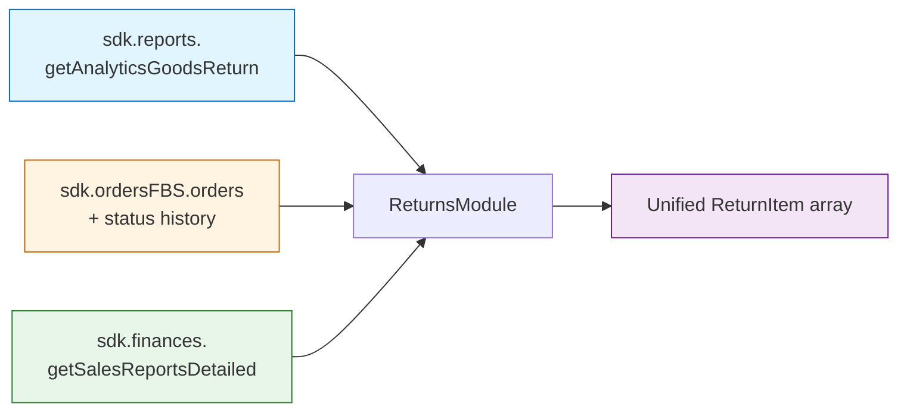

# Returns Module (sdk.returns)

## What `sdk.returns` gives you

`sdk.returns` is an aggregator module introduced in v3.10.0 that unifies three separate WB data sources — FBO analytics, FBS order history, and Finance reports — into a single `ReturnItem[]`. Instead of maintaining your own join logic across endpoints with different update cadences, you call one method and receive a deduplicated, finance-enriched return list with per-source telemetry. Partial failures are surfaced transparently: if one source is unavailable, the other sources still return data and the failure is reported in `partialFailures`. Return reasons are automatically classified to stable `ReturnReasonCode` enum values via `classifyReturnReason()`, which is called internally on every record.



**Happy path — fetch one month of returns:**

```typescript
import { WildberriesSDK } from 'daytona-wildberries-typescript-sdk';

const sdk = new WildberriesSDK({ apiKey: process.env.WB_API_KEY! });

const result = await sdk.returns.getReturns({
  dateFrom: '2026-04-01',
  dateTo: '2026-04-30',
});

console.log(`Total returns: ${result.total}`);
console.log(`FBO fetched: ${result._meta.sources.fbo.fetched}`);
result.data.forEach((r) => {
  console.log(r.orderId, r.returnReasonCode, r.returnAmount ?? 'pending');
});
```

---

## What WB does NOT expose

| Limitation | Why | SDK Workaround |
|-----------|-----|----------------|
| No webhooks for return events | WB does not provide webhook subscriptions | Poll `getReturns()` periodically (every 5-15 min recommended) |
| No `in_transit` return status | WB exposes only initiated/received/processed states | `ReturnStatus` union excludes intermediate states intentionally |
| Free-text Russian return reasons | WB returns reason as human-readable text only | Use `classifyReturnReason()` → maps to stable `ReturnReasonCode` enum |
| Weekly finance cadence | Sales Reports v1 publishes on Mondays | `returnAmount` may be `undefined` for returns within last ~7 days |
| No `returnCategory` for FBO | Only FBS status history reveals category | FBO records get `returnCategory: 'unknown'`; FBS implementation deferred to v3.10.1 |
| 31-day max date range | WB `getAnalyticsGoodsReturn` enforces this limit | Throws clear error; consumer chunks request manually ([Recipe 4](#recipe-4-multi-month-range-chunking-pattern)) |
| No `vendorCode` for FBO | `getAnalyticsGoodsReturn` doesn't expose it | Always `undefined` for FBO records |

---

## Recipes

### Recipe 1: Daily classification report

Aggregate return counts by reason code for a single calendar day. The report accounts for partial failures so counts are never silently understated.

```typescript
import { WildberriesSDK } from 'daytona-wildberries-typescript-sdk';

async function dailyClassificationReport(sdk: WildberriesSDK, date: string) {
  const next = new Date(date);
  next.setDate(next.getDate() + 1);
  const dateTo = next.toISOString().slice(0, 10);

  const result = await sdk.returns.getReturns({
    dateFrom: date,
    dateTo,
  });

  if (result.partialFailures.length > 0) {
    console.warn('Partial failures — counts may be understated:', result.partialFailures);
  }

  const byReason = new Map<string, number>();
  for (const r of result.data) {
    byReason.set(r.returnReasonCode, (byReason.get(r.returnReasonCode) ?? 0) + 1);
  }

  return { date, total: result.data.length, byReason: Object.fromEntries(byReason) };
}
```

### Recipe 2: Per-nmId reconciliation with buyouts

Use `getReturnStats()` for the aggregated view and `reconcileBuyoutsAndReturns()` (from the v3.9.3 helpers, see [Related Resources](#related-resources)) for the per-unit reconciliation.

```typescript
import {
  WildberriesSDK,
  reconcileBuyoutsAndReturns,
  type BuyoutInput,
} from 'daytona-wildberries-typescript-sdk';

async function reconcileForSku(
  sdk: WildberriesSDK,
  nmId: number,
  dateFrom: string,
  dateTo: string
) {
  const stats = await sdk.returns.getReturnStats({
    dateFrom, dateTo, groupBy: 'nmId', nmIds: [nmId],
  });

  // `fetchBuyoutsFromYourSource` is your own helper — query your DB or buyouts API
  // and shape results into BuyoutInput[]. Not provided by the SDK.
  const buyouts: BuyoutInput[] = await fetchBuyoutsFromYourSource(nmId, dateFrom, dateTo);

  const allReturns = await sdk.returns.getReturns({ dateFrom, dateTo, nmIds: [nmId] });
  const summary = reconcileBuyoutsAndReturns(buyouts, allReturns.data);

  return { stats, summary, anomalies: summary.flatMap((s) => s.anomalies) };
}
```

### Recipe 3: Anomaly detection (dashboard alerting)

Flag SKUs with high return counts. `pendingFinanceCount` indicates how many records are waiting for the weekly finance publish cycle — those amounts are not reflected in `totalAmount`.

```typescript
import { WildberriesSDK } from 'daytona-wildberries-typescript-sdk';

async function flagSuspiciousReturns(sdk: WildberriesSDK, dateFrom: string, dateTo: string) {
  const stats = await sdk.returns.getReturnStats({
    dateFrom, dateTo, groupBy: 'nmId',
  });

  const SUSPICIOUS_RATE_THRESHOLD = 0.5;
  // Filter low-noise buckets. Tune this threshold to your fleet size:
  // 5 is reasonable for a 100-1000 SKU catalog. Larger catalogs may want 10+.
  const MIN_RETURNS_TO_FLAG = 5;
  const flagged = stats.buckets
    .filter((b) => b.count >= MIN_RETURNS_TO_FLAG)
    .map((b) => ({
      nmId: Number(b.key),
      returnCount: b.count,
      avgAmount: b.totalAmount / Math.max(1, b.count - b.pendingFinanceCount),
      pendingFinance: b.pendingFinanceCount,
    }));

  return { flaggedSkus: flagged, totalReturns: stats.totalReturns };
}
```

### Recipe 4: Multi-month range (chunking pattern)

`getReturns()` enforces a 31-day maximum. For longer ranges, chunk the request manually and merge results.

```typescript
import type { WildberriesSDK, ReturnItem } from 'daytona-wildberries-typescript-sdk';

async function getReturnsForLongRange(
  sdk: WildberriesSDK,
  dateFrom: string,
  dateTo: string
): Promise<ReturnItem[]> {
  const all: ReturnItem[] = [];
  const start = new Date(dateFrom);
  const end = new Date(dateTo);

  let chunkStart = new Date(start);
  while (chunkStart < end) {
    const chunkEnd = new Date(chunkStart);
    chunkEnd.setDate(chunkEnd.getDate() + 30); // 30 days to stay under 31-day limit
    if (chunkEnd > end) chunkEnd.setTime(end.getTime());

    const result = await sdk.returns.getReturns({
      dateFrom: chunkStart.toISOString().slice(0, 10),
      dateTo: chunkEnd.toISOString().slice(0, 10),
    });
    all.push(...result.data);

    chunkStart = new Date(chunkEnd);
    chunkStart.setDate(chunkStart.getDate() + 1);
  }

  return all.sort((a, b) => b.returnDate.localeCompare(a.returnDate));
}
```

---

## Method Reference

### `getReturns(params: ReturnsApiRequest): Promise<ReturnsApiResponse>`

The primary aggregation method. Fetches FBO returns in parallel with Finance enrichment data, merges them, deduplicates by `srid`, applies optional filters, and returns the result with full telemetry.

**Parameters (`ReturnsApiRequest`):**

| Field | Type | Required | Description |
|-------|------|----------|-------------|
| `dateFrom` | `string` | Yes | ISO 8601 date (`YYYY-MM-DD`). Start of the range (inclusive). |
| `dateTo` | `string` | Yes | ISO 8601 date (`YYYY-MM-DD`). End of the range (inclusive). Must be `>= dateFrom`. |
| `nmIds` | `number[]` | No | Filter by SKU. Applied as a post-filter on the merged result. |
| `orderType` | `'fbo' \| 'fbs'` | No | Restrict to one fulfillment type. Omitting fetches both. |
| `includeFbsStatusHistory` | `boolean` | No | Reserved for v3.10.1. Passing `true` today adds a warning and skips FBS. Default `false`. |
| `fbsStatusHistoryLimit` | `number` | No | Hard cap on FBS orders processed. Default `100`. Reserved for v3.10.1. |
| `limit` | `number` | No | Pagination: max items in `data`. Applied to merged result. Default: no limit. |
| `offset` | `number` | No | Pagination: skip first N items. Default `0`. |

**Throws:** `Error` when `dateFrom > dateTo`, the range exceeds 31 days, or either date string is invalid. These are synchronous validation errors — no network call is made.

**Response (`ReturnsApiResponse`):**

| Field | Type | Description |
|-------|------|-------------|
| `data` | `ReturnItem[]` | Unified return records, sorted by `returnDate` descending. Paginated when `limit`/`offset` provided. |
| `total` | `number` | Total count **before** pagination. |
| `warnings` | `string[]` | Non-fatal informational messages. |
| `partialFailures` | `PartialFailure[]` | Per-source failures when one source is down but others succeed. |
| `_meta` | `ReturnsMeta` | Per-source telemetry. See [Telemetry Contract](#telemetry-contract). |

**`ReturnItem` fields:**

| Field | Type | Source | Notes |
|-------|------|--------|-------|
| `orderId` | `string` | FBO / FBS | WB order ID as string (BigInt safe). |
| `nmId` | `number` | All sources | SKU. |
| `vendorCode` | `string \| undefined` | FBS only | Always `undefined` for FBO records in v3.10.0. |
| `orderType` | `'fbo' \| 'fbs'` | Derived | Fulfillment path of the order. |
| `returnDate` | `string` | FBO: `completedDt` or `readyToReturnDt`; FBS: status transition | ISO 8601 datetime string. |
| `returnStatus` | `ReturnStatus` | FBO: derived from `isStatusActive`; FBS: status history | `'initiated' \| 'received' \| 'processed'`. No `'in_transit'`. |
| `returnReason` | `string` | FBO/FBS | Free-text Russian reason from WB. |
| `returnReasonCode` | `ReturnReasonCode` | Derived | Standardized code via `classifyReturnReason()`. Stable across WB text changes. |
| `returnCategory` | `ReturnCategory` | FBS preferred | `'unknown'` for all FBO records in v3.10.0. FBS deferred to v3.10.1. |
| `quantity` | `number` | FBO/FBS | Always `1` per record (each goods-return record = one unit). |
| `returnAmount` | `number \| undefined` | Finance | Rubles. `undefined` when finance not yet published (weekly cadence). |
| `srid` | `string \| undefined` | Finance | Sales Realization ID. Used for cross-source deduplication and reconciliation. |

---

### `getReturnByOrderId(orderId: string, params: ReturnByOrderIdParams): Promise<ReturnItem | null>`

Convenience wrapper around `getReturns()` that filters to a single order. Returns `null` when no matching record is found in the date window.

**Parameters:**

| Field | Type | Required | Description |
|-------|------|----------|-------------|
| `orderId` | `string` | Yes | WB order ID. Throws if empty string. |
| `params.dateFrom` | `string` | Yes | Same date window semantics as `getReturns()`. |
| `params.dateTo` | `string` | Yes | Same date window semantics as `getReturns()`. |
| `params.orderType` | `'fbo' \| 'fbs'` | No | Optional fulfillment-type hint. When provided, the underlying call skips the unrelated source, reducing rate-limit usage. Use when you know the order type. |

**Note on partial failures:** This method returns `null` when no record matches, which is indistinguishable from a partial failure that suppressed the record. When you need failure visibility, call `getReturns()` directly and inspect `partialFailures`.

```typescript
const ret = await sdk.returns.getReturnByOrderId('123456789', {
  dateFrom: '2026-04-01',
  dateTo: '2026-04-30',
  orderType: 'fbo', // skip FBS fetch — saves one rate-limit slot
});
if (ret) {
  console.log(ret.returnReason, ret.returnAmount);
}
```

---

### `getReturnStats(params: ReturnStatsParams): Promise<ReturnStatsResult>`

Calls `getReturns()` once (no pagination limit) and post-processes all records into aggregation buckets in memory.

**Parameters (`ReturnStatsParams`):**

| Field | Type | Required | Description |
|-------|------|----------|-------------|
| `dateFrom` | `string` | Yes | ISO 8601 date. |
| `dateTo` | `string` | Yes | ISO 8601 date. Same 31-day limit applies. |
| `groupBy` | `'nmId' \| 'category' \| 'orderType'` | Yes | Aggregation dimension. |
| `nmIds` | `number[]` | No | Pre-filter passed to `getReturns()`. |
| `orderType` | `'fbo' \| 'fbs'` | No | Pre-filter passed to `getReturns()`. |

**`groupBy` values:**

- `'nmId'` — one bucket per unique SKU. Bucket `key` is the nmId stringified.
- `'category'` — one bucket per `ReturnCategory` value (`cancel_before_shipment`, `refusal_at_pvz`, `return_after_receipt`, `unknown`). Note: all FBO records are `'unknown'` in v3.10.0.
- `'orderType'` — two buckets: `'fbo'` and `'fbs'`. FBS bucket will be empty in v3.10.0.

**Response (`ReturnStatsResult`):**

| Field | Type | Description |
|-------|------|-------------|
| `buckets` | `ReturnStatsBucket[]` | Aggregation buckets, sorted by `count` descending (key ascending as tiebreaker). |
| `totalReturns` | `number` | Sum of all bucket counts. |
| `totalAmount` | `number` | Sum of all `totalAmount` values across buckets. |
| `warnings` | `string[]` | Forwarded from underlying `getReturns()` call. |
| `partialFailures` | `PartialFailure[]` | Forwarded from underlying `getReturns()` call. |
| `_meta` | `ReturnsMeta` | Forwarded from underlying `getReturns()` call. |

**`ReturnStatsBucket` fields:**

| Field | Type | Description |
|-------|------|-------------|
| `key` | `string` | Group key: nmId as string, category name, or `'fbo'`/`'fbs'`. |
| `count` | `number` | Number of returns in this bucket. |
| `totalAmount` | `number` | Sum of `returnAmount` values (only records where finance has materialized). |
| `pendingFinanceCount` | `number` | Number of records with `returnAmount === undefined`. These are excluded from `totalAmount`. |

```typescript
const stats = await sdk.returns.getReturnStats({
  dateFrom: '2026-04-01',
  dateTo: '2026-04-30',
  groupBy: 'nmId',
});
stats.buckets.slice(0, 10).forEach((b) => {
  console.log(
    `nmId=${b.key}: ${b.count} returns, ${b.totalAmount} ₽ ` +
    `(${b.pendingFinanceCount} pending finance)`
  );
});
```

---

## Telemetry Contract

Every response from `getReturns()` (and transitively from `getReturnStats()`) includes a `_meta` object that reports exactly what happened in each source. Use it for observability and debugging before trusting zero counts.

### `_meta.sources`

```typescript
interface ReturnsMeta {
  sources: {
    fbo:     { fetched: number; skipped: boolean; failed: boolean; reason?: string };
    fbs:     { fetched: number; skipped: boolean; failed: boolean; reason?: string };
    finance: { fetched: number; skipped: boolean; failed: boolean; reason?: string };
  };
}
```

**Per-source fields:**

| Field | Type | Meaning |
|-------|------|---------|
| `fetched` | `number` | Number of records retrieved from this source. `0` when `skipped` or `failed`. |
| `skipped` | `boolean` | `true` when the source was intentionally not fetched (e.g., `orderType: 'fbo'` skips FBS; FBS is always skipped in v3.10.0). |
| `failed` | `boolean` | `true` when the fetch was attempted but threw. Accompanied by an entry in `partialFailures`. |
| `reason` | `string \| undefined` | Human-readable reason for `skipped` or `failed` state. |

**v3.10.0 invariants:**
- `_meta.sources.fbs.skipped` is always `true` (FBS implementation deferred to v3.10.1).
- `_meta.sources.fbs.reason` is always `'v3.10.0: implementation deferred'`.

### `partialFailures`

```typescript
interface PartialFailure {
  source: 'fbo' | 'fbs' | 'finance';
  error: string;
}
```

`partialFailures` is populated when one source throws during the parallel fetch but the others succeed. The response is still returned — it is not thrown. This enables partial data to reach consumers rather than an all-or-nothing failure.

**What to do when `partialFailures` is non-empty:**

1. Log the failure with context (date range, source, error message).
2. Treat counts and amounts from the affected source as understated, not zero.
3. Retry the specific date range later — WB API transient failures are common.
4. For `finance` failure: amounts will be `undefined` across the board; FBO counts are still accurate.
5. For `fbo` failure: `data` will be empty (or FBS-only in v3.10.1+); do not interpret as "no returns".

**Example check:**

```typescript
const result = await sdk.returns.getReturns({ dateFrom: '2026-04-01', dateTo: '2026-04-30' });

if (result.partialFailures.length > 0) {
  for (const f of result.partialFailures) {
    console.error(`[returns] Source '${f.source}' failed: ${f.error}`);
  }
  // Decide: surface degraded indicator, skip cache write, schedule retry
}
```

### `warnings`

`warnings` is a `string[]` of informational messages that do not prevent the response from being usable. They do not indicate data loss — they explain expected behavior.

**What triggers a warning:**

- FBS source skipped because `includeFbsStatusHistory` was not passed (expected in v3.10.0).
- FBS source skipped because `includeFbsStatusHistory: true` was passed (no-op in v3.10.0, with explanation).
- Finance data truncated at safety cap (500k rows) — narrow the date range.

Warnings are informational only. You do not need to act on them unless you are debugging unexpected `undefined` amounts or unexpected FBS omission.

---

## Related Resources

- [Buyout & Return Reconciliation Guide](/guides/buyout-return-reconciliation) — lower-level helpers introduced in v3.9.3: `classifyReturnReason()`, `enrichReturnsWithType()`, `reconcileBuyoutsAndReturns()`. The `sdk.returns` module calls `classifyReturnReason()` internally; use these helpers when you need finer-grained control over the classification or reconciliation steps.

- [Finance Reports v5 to v1 Migration Guide](/guides/migration-finance-reports-v5-to-v1) — reference for the `getSalesReportsDetailed()` endpoint that provides the weekly finance enrichment data used by `sdk.returns`.

- [ReturnsModule — TypeDoc API Reference](/api/classes/ReturnsModule) — generated TypeDoc reference with full parameter types, return types, and JSDoc for all three public methods.
