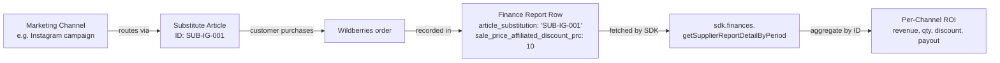

# Tracking Promotion Channels with Substitute Articles

> **Use case**: Finance reconciliation. After-the-fact attribution of settled revenue to specific external marketing campaigns using substitute article IDs from the Wildberries financial report.
>
> **Not for**: Real-time marketing analytics. If you need live campaign metrics during a campaign, use the analytics module's search query data (`includeSubstitutedSKUs` parameter on `getSearchQueriesV3`) — that's the marketing-team-facing tool. This guide is for finance teams matching marketing spend to actual paid revenue *after* the reporting period closes.

**Target audience**: Finance engineers, BI tool builders, platform operators serving multiple Wildberries sellers.

**Prerequisites**: SDK v3.6.0+, valid Wildberries API key with Statistics permissions, Node.js ≥20.

**Estimated reading time**: 10 minutes.

**Since**: SDK v3.6.0 (April 2026)

---

## What is a substitute article?

A **substitute article** (Russian: *подменный артикул*, transliterated: *podmenniy artikul*) is an alternate product identifier you create in the Wildberries seller portal under *Рост продаж → Подменные артикулы*. Each substitute article points to one of your real products but is shown to buyers under a different ID — and you can attach a dedicated discount (3%–50%) on top of your existing seller discount.

You use substitute articles to **route external marketing campaigns through unique identifiers**. Instead of pointing every Instagram post, blog feature, and influencer collaboration to the same product URL, you create one substitute article per campaign and link each campaign to its own ID. When a customer eventually buys, the substitute article ID is recorded in the financial report — and you can attribute the sale (and the discount) back to the specific marketing channel that drove it.

This feature was added by Wildberries on **2026-04-06** ([news id=11270](https://seller.wildberries.ru/news-v2/news-details?id=11270)).

## How the data flows



The SDK exposes the `article_substitution` and `sale_price_affiliated_discount_prc` fields on `DetailReportItem` (added in v3.6.0). You fetch the report, filter to rows where a substitute article was used, group by ID, and aggregate.

---

## SDK fields

After installing SDK v3.6.0+, the following optional fields are available on every `DetailReportItem` returned by `sdk.finances.getSupplierReportDetailByPeriod()`:

| Field | Type | Description |
|-------|------|-------------|
| `article_substitution` | `string` | Substitute article ID. Empty string `""` means no substitute article was used for this transaction. |
| `sale_price_affiliated_discount_prc` | `number` | Substitute article discount applied, as a percentage (e.g. `10` for 10%). |
| `sale_price_wholesale_discount_prc` | `number` | Wholesale business discount, as a percentage. Currently always `0` until WB launches the progressive wholesale discount tool — see [news id=11226](https://seller.wildberries.ru/news-v2/news-details?id=11226). |
| `agency_vat` | `number` | Agency VAT. Semantics undocumented by WB as of 2026-04-08; verify with WB before relying on values. |

## Production-grade aggregation pattern

The example below is intentionally written to handle real-world scale — multiple substitute articles, thousands of report rows, and the empty state. It uses **inline `reduce`** for aggregation rather than `Object.groupBy()` because the SDK supports Node 20 (where `Object.groupBy()` is unavailable).

```typescript
import { WildberriesSDK } from 'daytona-wildberries-typescript-sdk';
import type { DetailReportItem } from 'daytona-wildberries-typescript-sdk/finances';

interface ChannelAggregate {
  substituteArticleId: string;
  totalRevenueRub: number;
  totalQuantity: number;
  totalPayoutRub: number;
  averageDiscountPercent: number;
  orderCount: number;
}

async function reconcileSubstituteArticles(
  sdk: WildberriesSDK,
  dateFrom: string,
  dateTo: string
): Promise<ChannelAggregate[]> {
  // 1. Fetch all detail rows for the period
  const rows: DetailReportItem[] = await sdk.finances.getSupplierReportDetailByPeriod({
    dateFrom,
    dateTo,
    period: 'weekly',
  });

  // 2. Filter to rows that came through a substitute article
  const substituteRows = rows.filter(
    (row) => row.article_substitution != null && row.article_substitution !== ''
  );

  // 3. Handle empty state explicitly so consumers don't think the SDK is broken
  if (substituteRows.length === 0) {
    console.log(
      `No substitute article transactions found between ${dateFrom} and ${dateTo}. ` +
        'This is expected if no marketing campaigns ran through substitute articles in this period.'
    );
    return [];
  }

  // 4. Group by substitute article ID using inline reduce (Node 20-compatible)
  type Bucket = {
    revenueSum: number;
    quantitySum: number;
    payoutSum: number;
    discountSum: number;
    count: number;
  };

  const buckets = substituteRows.reduce<Record<string, Bucket>>((acc, row) => {
    const key = row.article_substitution!;
    if (!acc[key]) {
      acc[key] = { revenueSum: 0, quantitySum: 0, payoutSum: 0, discountSum: 0, count: 0 };
    }
    acc[key].revenueSum += row.retail_amount ?? 0;
    acc[key].quantitySum += row.quantity ?? 0;
    acc[key].payoutSum += row.ppvz_for_pay ?? 0;
    acc[key].discountSum += row.sale_price_affiliated_discount_prc ?? 0;
    acc[key].count += 1;
    return acc;
  }, {});

  // 5. Convert buckets to a sorted aggregate list
  return Object.entries(buckets)
    .map(([id, bucket]) => ({
      substituteArticleId: id,
      totalRevenueRub: bucket.revenueSum,
      totalQuantity: bucket.quantitySum,
      totalPayoutRub: bucket.payoutSum,
      averageDiscountPercent: bucket.discountSum / bucket.count,
      orderCount: bucket.count,
    }))
    .sort((a, b) => b.totalRevenueRub - a.totalRevenueRub);
}

// Usage
const sdk = new WildberriesSDK({ apiKey: process.env.WB_API_KEY! });
const channels = await reconcileSubstituteArticles(sdk, '2026-04-01', '2026-04-30');

console.table(channels);
// ┌─────────┬──────────────────────┬────────────────┬──────────────┬──────────────┬─────────────────────────┬──────────────┐
// │ (index) │ substituteArticleId  │ totalRevenueRub│ totalQuantity│ totalPayoutRub│ averageDiscountPercent  │  orderCount  │
// ├─────────┼──────────────────────┼────────────────┼──────────────┼──────────────┼─────────────────────────┼──────────────┤
// │    0    │   'SUB-IG-001'       │     54_300     │      36      │    46_155    │           10            │      36      │
// │    1    │   'SUB-BLOG-002'     │     21_800     │      14      │    18_530    │            5            │      14      │
// │    2    │   'SUB-INFLUENCER-3' │      8_900     │       6      │     7_565    │           15            │       6      │
// └─────────┴──────────────────────┴────────────────┴──────────────┴──────────────┴─────────────────────────┴──────────────┘
```

## Mapping substitute article IDs to marketing channels

The SDK returns the raw substitute article ID. Mapping that ID back to a human-readable marketing channel is something you do **outside the SDK** — typically a small lookup table you maintain alongside your campaign records:

```typescript
const channelLabels: Record<string, string> = {
  'SUB-IG-001': 'Instagram — April spring collection campaign',
  'SUB-BLOG-002': 'Tech blog feature — March 28',
  'SUB-INFLUENCER-3': 'Influencer collab — Anna K.',
};

const labeled = channels.map((c) => ({
  ...c,
  channel: channelLabels[c.substituteArticleId] ?? '(unmapped)',
}));
```

When you create a substitute article in the seller portal, record both the ID and the campaign metadata in your own system at the same time. The SDK has no view into your campaign-management side, so this mapping is your responsibility.

## Complementary data sources

**For real-time marketing tracking** (during a campaign rather than after settlement), use the analytics module's search report endpoints. These accept an `includeSubstitutedSKUs` parameter and the response items include an `IsSubstitutedSKU` boolean indicating whether the search query went through a substitute article:

```typescript
// Real-time: create a search-report job, then poll for results
await sdk.analytics.createSearchReportReport({
  // ... your params, including:
  // includeSubstitutedSKUs: true,
  // includeSearchTexts: true,
});
```

Available analytics methods that support substitute article filtering: `createSearchReportReport`, `createSearchReportTableGroups`, `createSearchReportTableDetails`. See the [Search Queries Analytics guide](/guides/search-queries-analytics) for the full workflow.

The two views serve different audiences:

| View | Module | Use case | Audience |
|------|--------|----------|----------|
| Search query telemetry | `analytics` (since v3.4.0) | Did customers find the product via substitute article? | Marketing team, real-time |
| Sale attribution | `finances` (this guide, since v3.6.0) | Which sales came from which substitute article? | Finance team, after settlement |

## Caveats

- **Substitute article disablement**: Wildberries allows sellers to disable substitute articles, and once disabled they cannot be re-enabled. Whether the `article_substitution` field remains populated in **historical** finance reports after disablement is not yet verified — assume it persists (typical Wildberries archival behavior) but verify before relying on it for long-term analysis.
- **No management API**: As of 2026-04-08 there is no public Wildberries API for creating, listing, or disabling substitute articles. This must be done in the seller portal under *Рост продаж → Подменные артикулы*. The SDK exposes the data flowing into the finance report; it does not manage the substitute articles themselves.
- **`agency_vat` semantics undocumented**: The `agency_vat` field appears in the API response but is not documented in any WB news article or local OpenAPI spec. Verify with WB before using.
- **Wholesale discount field returns 0**: `sale_price_wholesale_discount_prc` is currently always `0`. It will populate once Wildberries launches the progressive wholesale discount tool — see [news id=11226](https://seller.wildberries.ru/news-v2/news-details?id=11226).

## Rate limits

`getSupplierReportDetailByPeriod` is rate-limited to **1 request per minute per seller account**. For batch reconciliation jobs, add appropriate delays or rely on the SDK's built-in rate limiter (it will queue requests automatically).

## Related resources

- WB news (substitute articles, 2026-04-06): https://seller.wildberries.ru/news-v2/news-details?id=11270
- WB news (wholesale discount, 2026-04-02): https://seller.wildberries.ru/news-v2/news-details?id=11226
- WB API docs: https://dev.wildberries.ru/docs/openapi/financial-reports-and-accounting#tag/Finansovye-otchyoty/paths/~1api~1v5~1supplier~1reportDetailByPeriod/get
- SDK Finances module reference: [/api/classes/FinancesModule](/api/classes/FinancesModule)
- SDK Analytics search queries (complementary): [Search Queries Analytics](/guides/search-queries-analytics)

---

> **🌐 Russian translation**: Deferred to a follow-up task. Consistent with prior sprint convention (sprints 4–5 deferred RU translations on all new English guides). Track via the project's localization backlog.
