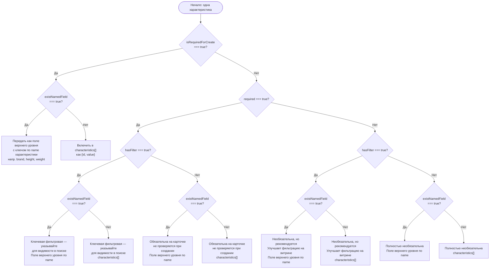

# Обязательные характеристики товаров

С **29 апреля 2026 года** Wildberries требует указание обязательных характеристик для карточек товаров в определённых категориях. Карточки, созданные без этих характеристик, будут отклонены API.

## Что изменилось

Эндпоинт `GET /content/v2/object/charcs/{subjectId}` теперь возвращает булево поле `isRequiredForCreate`. Если значение `true`, характеристика **обязательна** при создании и обновлении карточки.

В SDK добавлен интерфейс `SubjectCharacteristic` (v3.9.0) с полной типизацией для этого поля.

## Затронутые категории

| Категория | subjectId | English Name |
|-----------|-----------|--------------|
| Флешки памяти | 1260 | Flash Drives |
| Фитнес-браслеты | 1514 | Fitness Bracelets |
| Выпрямители волос | 2314 | Hair Straighteners |
| Блендеры | 614 | Blenders |
| Неттопы и Мини ПК | 8992 | Nettops & Mini PCs |
| Фоторамки | 28 | Photo Frames |
| Калькуляторы | 977 | Calculators |
| Крышки | 819 | Lids |
| Наволочки | 605 | Pillowcases |
| Салфетки для уборки | 1202 | Cleaning Wipes |

::: tip
Этот список может расширяться. Всегда проверяйте `isRequiredForCreate` для вашей категории перед созданием карточек.
:::

## Флаг роутинга: `existNamedField`

Добавлен в **v3.10.2** (анонс WB API 06.05.2026), `existNamedField` — булево поле `SubjectCharacteristic`, которое определяет, **куда** поместить значение характеристики в запросе на создание/обновление карточки:

| Значение `existNamedField` | Куда поместить значение |
|---------------------------|-------------------------|
| `false` или `undefined` | В массив `characteristics[]` как `{ id, value }` |
| `true` | В **поле верхнего уровня** объекта карточки, с ключом по `name` характеристики |

### Известные поля верхнего уровня

Следующие широко известные характеристики имеют `existNamedField: true` в большинстве категорий:

| Имя характеристики (`name`) | Поле верхнего уровня |
|-----------------------------|----------------------|
| `brand` | `data.brand` |
| `name` | `data.name` (название товара) |
| `height` | `data.dimensions.height` / `data.height` |
| `length` | `data.dimensions.length` / `data.length` |
| `width` | `data.dimensions.width` / `data.width` |
| `weight` | `data.dimensions.weightGross` / `data.weight` |

::: tip
Этот список содержит распространённые примеры и **не является исчерпывающим**. Всегда вызывайте `getCategoryCharacteristics()` (или `getObjectCharc(subjectId)`) для получения актуального набора характеристик категории и проверяйте флаг `existNamedField` для каждой из них.
:::

### Пример роутинга на TypeScript

```typescript
import { WildberriesSDK, validateRequiredCharacteristics } from 'daytona-wildberries-typescript-sdk';
import type { SubjectCharacteristic, CardCharacteristicInput } from 'daytona-wildberries-typescript-sdk';

const sdk = new WildberriesSDK({ apiKey: process.env.WB_API_KEY! });
const charcsResult = await sdk.products.getObjectCharc(1260);
const allChars: SubjectCharacteristic[] = charcsResult.data ?? [];

// Разделяем по флагу роутинга
const inlineChars = allChars.filter((c) => !c.existNamedField); // → characteristics[]
const namedChars = allChars.filter((c) => c.existNamedField === true); // → поля верхнего уровня

// Формируем characteristics[] для инлайн-характеристик
const characteristics: CardCharacteristicInput[] = inlineChars.map((c) => ({
  id: c.charcID!,
  value: getValueForCharacteristic(c), // Ваша бизнес-логика
}));

// Формируем карту именованных полей для характеристик верхнего уровня
const namedFields: Record<string, unknown> = {};
for (const c of namedChars) {
  if (c.name) namedFields[c.name] = getValueForCharacteristic(c);
}

// Валидируем перед отправкой (вызов v3.10.2+)
const missing = validateRequiredCharacteristics(allChars, characteristics, namedFields);
if (missing.length > 0) {
  throw new Error(`Отсутствуют обязательные характеристики: ${missing.map((c) => c.name).join(', ')}`);
}

// Создаём карточку — именованные поля верхнего уровня передаются наряду с массивом characteristics
// (точный путь поля зависит от контракта API вашей категории)
const response = await sdk.products.createCardsUpload([{
  subjectID: 1260,
  variants: [{
    vendorCode: 'FLASH-USB-64GB',
    title: (namedFields['name'] as string | undefined) ?? 'USB-флешка 64ГБ',
    brand: (namedFields['brand'] as string | undefined) ?? '',
    characteristics,
    sizes: [{ techSize: 'one-size', wbSize: '', skus: ['1234567890123'] }],
  }],
}]);

function getValueForCharacteristic(c: SubjectCharacteristic): string | number | string[] {
  switch (c.charcType) {
    case 0: return 'текстовое значение';
    case 1: return 64;
    case 4: return ['значение1'];
    default: return '';
  }
}
```

## Флаг фильтра: `hasFilter`

Также добавлен в **v3.10.2**, `hasFilter` — булево поле `SubjectCharacteristic`, указывающее, что данная характеристика используется как **фильтр категории на витрине Wildberries** (панель фильтров слева, которую покупатели используют для сужения результатов поиска).

**Правило совместного использования**: когда оба флага `required: true` и `hasFilter: true` установлены одновременно, характеристика является **ключевой (фильтровой)** — она должна быть указана для того, чтобы карточка отображалась в результатах поиска с фильтрами в данной категории.

### Определение обязательных характеристик-фильтров

```typescript
import { WildberriesSDK } from 'daytona-wildberries-typescript-sdk';
import type { SubjectCharacteristic } from 'daytona-wildberries-typescript-sdk';

const sdk = new WildberriesSDK({ apiKey: process.env.WB_API_KEY! });
const charcsResult = await sdk.products.getObjectCharc(1260);
const allChars: SubjectCharacteristic[] = charcsResult.data ?? [];

// Ключевые/фильтровые обязательные характеристики — наиболее критичные для видимости в поиске
const keyFilterChars = allChars.filter(
  (c) => c.required === true && c.hasFilter === true
);

// Обязательные при создании, но не являющиеся фильтрами витрины
const createOnlyMandatory = allChars.filter(
  (c) => c.isRequiredForCreate === true && !c.hasFilter
);

console.log('Ключевые фильтровые характеристики (обязательны для видимости в поиске):');
for (const c of keyFilterChars) {
  console.log(`  - ${c.name} (existNamedField: ${c.existNamedField ?? false})`);
}
console.log('Обязательные при создании (без влияния на фильтры):');
for (const c of createOnlyMandatory) {
  console.log(`  - ${c.name}`);
}
```

## Матрица обязательности

Таблица ниже отображает все комбинации четырёх булевых флагов `SubjectCharacteristic` с указанием требуемого действия и места в API-запросе. Ветвление соответствует логике `src/utils/validateRequiredCharacteristics.ts`.

**Обозначение**: `false/undef` — сокращение для `false | undefined` в ячейках ниже. Помощник SDK обрабатывает оба значения одинаково.

| `required` | `isRequiredForCreate` | `existNamedField` | `hasFilter` | Действие | Место в запросе |
|:----------:|:--------------------:|:-----------------:|:-----------:|----------|-----------------|
| `true` | `true` | `false`/undef | `false`/undef | **ОБЯЗАТЕЛЬНО указать** | `characteristics[]` |
| `true` | `true` | `false`/undef | `true` | **ОБЯЗАТЕЛЬНО** (ключевая фильтровая) | `characteristics[]` |
| `true` | `true` | `true` | `false`/undef | **ОБЯЗАТЕЛЬНО указать** | Поле верхнего уровня по `name` |
| `true` | `true` | `true` | `true` | **ОБЯЗАТЕЛЬНО** (ключевая фильтровая) | Поле верхнего уровня по `name` |
| `true` | `false`/undef | `false`/undef | `false`/undef | Мягко-обязательное (валидируется сервером; помощник SDK не блокирует на этапе создания — см. примечание 3) | `characteristics[]` |
| `true` | `false`/undef | `false`/undef | `true` | Обязательна + фильтровая; указывайте для видимости в поиске | `characteristics[]` |
| `true` | `false`/undef | `true` | `false`/undef | Мягко-обязательное (валидируется сервером; помощник SDK не блокирует на этапе создания — см. примечание 3) | Поле верхнего уровня по `name` |
| `true` | `false`/undef | `true` | `true` | Обязательна + фильтровая; указывайте для видимости в поиске | Поле верхнего уровня по `name` |
| `false`/undef | `true` | `false`/undef | `false`/undef | **ОБЯЗАТЕЛЬНО** (проверяется при создании) | `characteristics[]` |
| `false`/undef | `true` | `false`/undef | `true` | **ОБЯЗАТЕЛЬНО** | `characteristics[]` |
| `false`/undef | `true` | `true` | `false`/undef | **ОБЯЗАТЕЛЬНО** | Поле верхнего уровня по `name` |
| `false`/undef | `true` | `true` | `true` | **ОБЯЗАТЕЛЬНО** | Поле верхнего уровня по `name` |
| `false`/undef | `false`/undef | `false`/undef | `false`/undef | Необязательна — указывайте при наличии значения | `characteristics[]` |
| `false`/undef | `false`/undef | `false`/undef | `true` | Необязательна — рекомендуется для видимости в фильтрах | `characteristics[]` |
| `false`/undef | `false`/undef | `true` | `false`/undef | Необязательна | Поле верхнего уровня по `name` |
| `false`/undef | `false`/undef | `true` | `true` | Необязательна — рекомендуется для видимости в фильтрах | Поле верхнего уровня по `name` |

**Примечания**:
- `hasFilter` определяет лишь то, является ли характеристика ключом фильтра витрины — сам по себе этот флаг не делает характеристику обязательной. Обязательность определяется флагами `required` и/или `isRequiredForCreate`.
- Строки, где оба флага `required` и `isRequiredForCreate` равны `false`/`undefined`, являются полностью необязательными с точки зрения API. Указание таких характеристик улучшает видимость в поиске при `hasFilter: true`.
- `validateRequiredCharacteristics()` проверяет строки, где `isRequiredForCreate === true`. Строки только с `required: true` не проверяются хелпером — они зависят от серверной политики WB для конкретной категории.

## Дерево решений

Используйте эту схему для роутинга любой отдельной характеристики при формировании запроса на создание/обновление карточки:



## Варьируемые и фиксированные характеристики (v3.9.2)

При создании **объединённых карточек** (несколько вариантов под одним listing — например, одно платье в разных цветах) каждая характеристика относится к одному из двух типов:

- **Варьируемая** (`isVariable: true`) — варианты МОГУТ отличаться по этой характеристике (цвет, объём, аромат)
- **Фиксированная** (`isVariable: false`) — все варианты ДОЛЖНЫ иметь одинаковое значение (бренд, состав, страна)

Поле `isVariable` возвращается методом `getObjectCharc()` рядом с `isRequiredForCreate`. Используйте его для валидации вариантов объединённой карточки до отправки.

### Фильтрация по isVariable

```typescript
const charcs = await sdk.products.getObjectCharc(2314); // Выпрямители волос

const variableChars = charcs.data?.filter((c) => c.isVariable === true) ?? [];
const fixedChars = charcs.data?.filter((c) => c.isVariable === false) ?? [];

console.log('Варианты могут отличаться по:', variableChars.map((c) => c.name));
console.log('У всех вариантов одинаково:', fixedChars.map((c) => c.name));
```

### Валидация вариантов объединённой карточки

SDK предоставляет `validateMergedCardVariants()` для проверки ошибок перед отправкой в WB:

```typescript
import { validateMergedCardVariants } from 'daytona-wildberries-typescript-sdk';

const charcs = await sdk.products.getObjectCharc(2314);
const result = validateMergedCardVariants(charcs.data ?? [], [
  {
    characteristics: [
      { id: 91, value: 'Acme' },        // Бренд (фиксированный)
      { id: 14177449, value: 'Red' },   // Цвет (варьируемый)
    ],
  },
  {
    characteristics: [
      { id: 91, value: 'Acme' },        // Тот же бренд (правильно)
      { id: 14177449, value: 'Blue' },  // Другой цвет (правильно)
    ],
  },
]);

if (result.divergentFixedChars.length > 0) {
  throw new Error(
    `Фиксированные характеристики отличаются у вариантов: ${result.divergentFixedChars.map((c) => c.name).join(', ')}`
  );
}
if (result.duplicateVariants) {
  throw new Error('Два варианта имеют идентичные варьируемые значения');
}
```

### Категории с особыми правилами

Для некоторых категорий WB требует **конкретные пары** варьируемых характеристик. Два варианта не могут иметь идентичные значения сразу по обеим обязательным парам:

| Категория | Обязательная варьируемая пара |
|-----------|-------------------------------|
| Косметические масла | Объём + Аромат |
| Гигиенические прокладки | Количество капель + Количество |
| Стиральный порошок | Объём + Вес |
| Лак для волос | Объём + Степень фиксации |

Источник: [Справочный центр WB — Объединение карточек товаров](https://seller.wildberries.ru/instructions/ru/ru/material/cards-merging)

## Проверка обязательных характеристик

Используйте `getObjectCharc()` для получения характеристик категории, а затем `validateRequiredCharacteristics()` (v3.9.0+, обновлён в v3.10.2) для проверки отсутствующих.

### Сигнатура хелпера v3.10.2

```
validateRequiredCharacteristics(
  characteristics: SubjectCharacteristic[],
  input: CardCharacteristicInput[],
  namedFields?: Record<string, unknown>   // НОВЫЙ параметр в v3.10.2
): SubjectCharacteristic[]
```

Третий параметр `namedFields` — объект с ключами по `name` характеристики, содержащий значения полей верхнего уровня, которые вы передаёте (например, `brand`, `height`). Без него хелпер работает в режиме обратной совместимости и эмитирует однократный `console.warn` при обнаружении обязательной характеристики с `existNamedField: true` — см. [CHANGELOG v3.10.2](/CHANGELOG#3102---2026-05-06-hotfix) с полным сообщением миграции.

### Три паттерна вызова

```typescript
import { WildberriesSDK, validateRequiredCharacteristics } from 'daytona-wildberries-typescript-sdk';
import type { SubjectCharacteristic, CardCharacteristicInput } from 'daytona-wildberries-typescript-sdk';

const sdk = new WildberriesSDK({ apiKey: process.env.WB_API_KEY! });

// Получаем характеристики для категории «Флешки памяти» (subjectId: 1260)
const result = await sdk.products.getObjectCharc(1260);
const allChars: SubjectCharacteristic[] = result.data ?? [];

// Формируем массив характеристик карточки
const myCharacteristics: CardCharacteristicInput[] = [
  { id: 101, value: '64GB' },    // Объём памяти
  { id: 202, value: 'USB 3.0' }, // Интерфейс
];

// ──────────────────────────────────────────────────
// Паттерн А: НОВЫЙ вызов (v3.10.2+) — рекомендуется
// Передаём поля верхнего уровня третьим аргументом.
// ──────────────────────────────────────────────────
const missingNew = validateRequiredCharacteristics(
  allChars,
  myCharacteristics,
  { brand: 'Acme', height: 10, length: 60, width: 20, weight: 0.05 }
);
if (missingNew.length > 0) {
  console.error('Отсутствуют (новый вызов):', missingNew.map((c) => c.name));
}

// ──────────────────────────────────────────────────
// Паттерн Б: УСТАРЕВШИЙ вызов (работает, выдаёт однократный warn)
// Третий аргумент не передаётся. Хелпер может давать ложные
// срабатывания для характеристик existNamedField:true.
// Мигрируйте на Паттерн А. См. CHANGELOG v3.10.2.
// ──────────────────────────────────────────────────
const missingLegacy = validateRequiredCharacteristics(allChars, myCharacteristics);
// ^ SDK помощник выводит предупреждение через console.warn (текст на английском — соответствует исходнику в src/utils/deprecation.ts):
// "validateRequiredCharacteristics: a required characteristic with
//   existNamedField:true was found, but no `namedFields` parameter was provided..."

// ──────────────────────────────────────────────────
// Паттерн В: СМЕШАННЫЙ — часть характеристик инлайн,
// именованные поля отдельно.
// Реальный сценарий: большинство характеристик в characteristics[],
// только brand/height передаются как поля верхнего уровня.
// ──────────────────────────────────────────────────
const inlineOnly: CardCharacteristicInput[] = allChars
  .filter((c) => !c.existNamedField)
  .map((c) => ({ id: c.charcID!, value: getValueForCharacteristic(c) }));

const named: Record<string, unknown> = {
  brand: 'Acme',
  height: 10,
};

const missingMixed = validateRequiredCharacteristics(allChars, inlineOnly, named);
if (missingMixed.length > 0) {
  console.error('Отсутствуют (смешанный):', missingMixed.map((c) => c.name));
}

function getValueForCharacteristic(c: SubjectCharacteristic): string | number | string[] {
  switch (c.charcType) {
    case 0: return 'текстовое значение';
    case 1: return 64;
    case 4: return ['значение1'];
    default: return '';
  }
}
```

## Создание карточек с обязательными характеристиками

После определения обязательных характеристик и их места (инлайн или верхний уровень) включите их в запрос на создание карточки. Сигнатура `validateMergedCardVariants()` в v3.10.2 принимает необязательный массив `namedFieldsPerVariant` (одна карта на вариант по индексу) для объединённых карточек, у которых варианты имеют разные `brand`, `height` или другие поля верхнего уровня.

```typescript
import { validateMergedCardVariants } from 'daytona-wildberries-typescript-sdk';
import type { CardCharacteristicInput, SubjectCharacteristic } from 'daytona-wildberries-typescript-sdk';

const sdk = new WildberriesSDK({ apiKey: process.env.WB_API_KEY! });

// 1. Получаем обязательные характеристики категории
const charcsResult = await sdk.products.getObjectCharc(1260);
const mandatory = (charcsResult.data ?? []).filter(
  (c) => c.isRequiredForCreate === true
);

// 2. Формируем массив characteristics[] только из инлайн-характеристик
const characteristics: CardCharacteristicInput[] = mandatory
  .filter((c) => !c.existNamedField)
  .map((c) => ({
    id: c.charcID!,
    value: getValueForCharacteristic(c), // Ваша бизнес-логика
  }));

// 3. Создаём карточку товара — именованные поля верхнего уровня передаются на уровне варианта
const response = await sdk.products.createCardsUpload([{
  subjectID: 1260,
  variants: [{
    vendorCode: 'FLASH-USB-64GB',
    title: 'USB-флешка 64ГБ',
    brand: 'Acme',          // Характеристика с existNamedField:true
    characteristics,
    sizes: [{ techSize: 'one-size', wbSize: '', skus: ['1234567890123'] }],
  }],
}]);

console.log('Карточка создана:', response);

// ──────────────────────────────────────────────────
// Объединённая карточка с несколькими вариантами (паттерн v3.10.2)
// Варианты одного бренда, но разных цветов.
// namedFieldsPerVariant передаёт поля верхнего уровня для каждого варианта.
// ──────────────────────────────────────────────────
const hairStraightenerChars = await sdk.products.getObjectCharc(2314);

const variantResult = validateMergedCardVariants(
  hairStraightenerChars.data ?? [],
  [
    { characteristics: [{ id: 14177449, value: 'Red' }] },   // Вариант 0: красный
    { characteristics: [{ id: 14177449, value: 'Blue' }] },  // Вариант 1: синий
  ],
  [
    { brand: 'Acme', height: 12, weight: 0.4 },  // Поля верхнего уровня варианта 0
    { brand: 'Acme', height: 12, weight: 0.4 },  // Поля верхнего уровня варианта 1 (одинаковые)
  ]
);

if (variantResult.divergentFixedChars.length > 0) {
  throw new Error(
    `Фиксированные характеристики отличаются: ${variantResult.divergentFixedChars.map((c) => c.name).join(', ')}`
  );
}
if (variantResult.duplicateVariants) {
  throw new Error('Два варианта имеют идентичные варьируемые значения');
}

// Хелпер: определяем значение на основе типа характеристики
function getValueForCharacteristic(c: SubjectCharacteristic): string | number | string[] {
  // Ваша логика определения значения на основе типа и данных товара
  switch (c.charcType) {
    case 0: return 'текстовое значение';  // Строка
    case 1: return 64;                     // Число (например, объём памяти в ГБ)
    case 4: return ['значение1', 'значение2']; // Массив
    default: return '';
  }
}
```

## Обработка ошибок

Если обязательная характеристика не указана, WB API отклонит запрос. Обработайте это в потоке ошибок:

```typescript
import { ValidationError } from 'daytona-wildberries-typescript-sdk';

try {
  await sdk.products.createCardsUpload([{ /* ... */ }]);
} catch (error) {
  if (error instanceof ValidationError) {
    console.error('Карточка отклонена — вероятно, отсутствуют обязательные характеристики');
    console.error('Детали:', error.message);
    // Перезагрузите обязательные характеристики и проверьте, что пропущено
  }
  throw error;
}
```

## Чек-лист миграции

Используйте этот чек-лист для подготовки до дедлайна 29 апреля и адаптации к флагам роутинга v3.10.2:

- [ ] **Определите затронутые категории** — проверьте, есть ли ваши категории в списке выше
- [ ] **Получите характеристики** — вызовите `getObjectCharc(subjectId)` для каждой затронутой категории
- [ ] **Отфильтруйте обязательные** — найдите все характеристики с `isRequiredForCreate === true`
- [ ] **Обновите код создания карточек** — убедитесь, что все обязательные характеристики включены в запросы create/update
- [ ] **Обновите SDK** — обновитесь до `daytona-wildberries-typescript-sdk@^3.9.0` для поддержки типа `SubjectCharacteristic`
- [ ] **Протестируйте** — создайте тестовые карточки в затронутых категориях для проверки до дедлайна
- [ ] **Проверьте `isVariable`** для объединённых карточек — у вариантов должны совпадать фиксированные и отличаться варьируемые характеристики
- [ ] **Используйте `validateMergedCardVariants()`** перед отправкой объединённых карточек, чтобы поймать расхождения фиксированных характеристик и дубликаты вариантов
- [ ] **Проверьте все вызовы `validateRequiredCharacteristics()`** — передавайте карту `namedFields` (с ключами по `name` характеристики) из формы вашего запроса третьим аргументом; без него выдаётся однократный warn и возможны ложные срабатывания для характеристик `existNamedField: true`. См. [CHANGELOG v3.10.2](/CHANGELOG#3102---2026-05-06-hotfix).
- [ ] **Проверьте все вызовы `validateMergedCardVariants()`** — передавайте `namedFieldsPerVariant` (массив карт именованных полей, по одной на вариант по индексу) третьим аргументом; без него выдаётся однократный warn для характеристик `existNamedField: true`.
- [ ] **Сверьтесь с матрицей обязательности** для категорий, с которыми работает ваша команда — убедитесь, какие характеристики попадают в `characteristics[]`, а какие в поля верхнего уровня, и какие имеют `hasFilter: true` (ключевые фильтровые характеристики, критичные для видимости в поиске)

## Связанные ресурсы

- [Работа с карточками товаров](/ru/guides/working-with-product-cards) — Полное руководство по управлению карточками
- [Справочник API: ProductsModule](/api/classes/ProductsModule) — Полная документация методов
- [WB API: Характеристики товаров](https://dev.wildberries.ru/docs/openapi/work-with-products#tag/Kategorii-predmety-i-harakteristiki) — Официальная документация WB
- [Анонс WB 06.05.2026](https://dev.wildberries.ru/release-notes) — Анонс WB, вводящий флаги `existNamedField` и `hasFilter` в `SubjectCharacteristic`
- [CHANGELOG v3.10.2](/CHANGELOG#3102---2026-05-06-hotfix) — Хотфикс SDK: обновлены `validateRequiredCharacteristics` + `validateMergedCardVariants` для роутинга `existNamedField`; сообщение миграции
- [Руководство по объединению карточек](/ru/guides/product-card-merging) — Полное руководство по объединённым карточкам (imtID, варианты, распределение трафика)
- Исходный код SDK — реализации хелперов:
  - [`src/utils/validateRequiredCharacteristics.ts`](../../src/utils/validateRequiredCharacteristics.ts)
  - [`src/utils/validateMergedCardVariants.ts`](../../src/utils/validateMergedCardVariants.ts)
