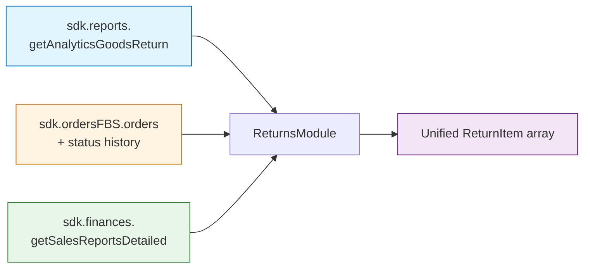

# Модуль возвратов (sdk.returns)

## Что предоставляет `sdk.returns`

`sdk.returns` — агрегатор, который объединяет три разрозненных источника данных WB в единый массив `ReturnItem`. Вместо того чтобы вручную вызывать `getAnalyticsGoodsReturn`, `ordersFBS.getOrders` и `getSalesReportsDetailed`, а затем склеивать их по `srid`, достаточно одного вызова. Внутри SDK обрабатывает pagination, фильтрацию по `nmId`, классификацию причин и финансовое обогащение. Частичные ошибки не роняют весь запрос — вы получаете данные из успешных источников вместе с прозрачным отчётом о том, что пошло не так.



### Быстрый старт

```typescript
import { WildberriesSDK } from 'daytona-wildberries-typescript-sdk';

const sdk = new WildberriesSDK({ apiKey: process.env.WB_API_KEY! });

// Получить все возвраты за последние 7 дней
const result = await sdk.returns.getReturns({
  dateFrom: '2026-04-23',
  dateTo: '2026-04-30',
});

console.log(`Всего возвратов: ${result.total}`);
console.log(`FBO: ${result.data.filter(r => r.orderType === 'fbo').length}`);
console.log(`FBS: ${result.data.filter(r => r.orderType === 'fbs').length}`);

// Проверить частичные ошибки
if (result.partialFailures.length > 0) {
  console.warn('Некоторые источники вернули ошибки:', result.partialFailures);
}
```

---

## Что WB не предоставляет

Ниже честный список ограничений платформы с указанием того, как SDK частично компенсирует каждое из них.

| Ограничение | Причина | Обходное решение в SDK |
|-------------|---------|------------------------|
| Webhooks не поддерживаются | WB не предоставляет подписки на события возвратов | Используйте polling `getReturns()` с интервалом 5–15 минут |
| Статус `in_transit` недоступен для FBO | WB открывает только три состояния: initiated/received/processed | Тип `ReturnStatus` намеренно не включает промежуточные FBO-статусы |
| Причины возврата возвращаются как свободный текст на русском | WB не предоставляет машиночитаемых кодов причин | Используйте `classifyReturnReason()` — маппинг на стабильный enum `ReturnReasonCode` |
| Еженедельная частота финансовых отчётов | Sales Reports v1 публикуется по понедельникам | `returnAmount` может быть `undefined` для возвратов последних ~7 дней |
| `returnCategory` недоступна для FBO | Категория выводится из истории статусов FBS | FBO-записи получают `returnCategory: 'unknown'`; реализация FBS перенесена в v3.10.1 |
| Максимальный диапазон дат — 31 день | Ограничение `getAnalyticsGoodsReturn` на стороне WB | SDK бросает понятную ошибку; разбейте запрос вручную ([Рецепт 4](#рецепт-4-длинный-диапазон-дат-разбивка-на-чанки)) |
| `vendorCode` недоступен для FBO | `getAnalyticsGoodsReturn` не возвращает это поле | Всегда `undefined` для FBO-записей в v3.10.0 |

::: warning FBS-источник в v3.10.0
Реализация FBS-источника перенесена в v3.10.1. В текущей версии FBS пропускается (`skipped: true` в `_meta.sources.fbs`). Передача `includeFbsStatusHistory: true` добавляет предупреждение и откатывается к пропуску источника.
:::

---

## Рецепты

### Рецепт 1: Ежедневный отчёт по классификации возвратов

Строит сводку причин за один день. Проверяет частичные ошибки перед агрегацией.

```typescript
async function dailyClassificationReport(sdk: WildberriesSDK, date: string) {
  const next = new Date(date);
  next.setDate(next.getDate() + 1);
  const dateTo = next.toISOString().slice(0, 10);

  const result = await sdk.returns.getReturns({
    dateFrom: date,
    dateTo,
  });

  if (result.partialFailures.length > 0) {
    // Числа могут быть занижены — один из источников недоступен
    console.warn('Частичные ошибки — данные могут быть неполными:', result.partialFailures);
  }

  const byReason = new Map<string, number>();
  for (const r of result.data) {
    byReason.set(r.returnReasonCode, (byReason.get(r.returnReasonCode) ?? 0) + 1);
  }

  return { date, total: result.data.length, byReason: Object.fromEntries(byReason) };
}
```

**Пример вывода:**
```json
{
  "date": "2026-04-29",
  "total": 43,
  "byReason": {
    "wrong_size": 18,
    "defect": 9,
    "not_as_described": 7,
    "customer_refused": 5,
    "other": 4
  }
}
```

---

### Рецепт 2: Сверка возвратов и выкупов по nmId

Объединяет агрегированную статистику возвратов с данными о выкупах. Требует данных о выкупах из вашего источника (отчёт по остаткам или CRM).

```typescript
import {
  reconcileBuyoutsAndReturns,
  type BuyoutInput,
} from 'daytona-wildberries-typescript-sdk';

async function reconcileForSku(sdk: WildberriesSDK, nmId: number, dateFrom: string, dateTo: string) {
  const stats = await sdk.returns.getReturnStats({
    dateFrom, dateTo, groupBy: 'nmId', nmIds: [nmId],
  });

  // `fetchBuyoutsFromYourSource` — ваш собственный хелпер: запросите свою БД
  // или API выкупов и приведите результат к BuyoutInput[]. SDK его не предоставляет.
  const buyouts: BuyoutInput[] = await fetchBuyoutsFromYourSource(nmId, dateFrom, dateTo);

  const allReturns = await sdk.returns.getReturns({ dateFrom, dateTo, nmIds: [nmId] });
  const summary = reconcileBuyoutsAndReturns(buyouts, allReturns.data);

  return { stats, summary, anomalies: summary.flatMap((s) => s.anomalies) };
}
```

::: tip
`reconcileBuyoutsAndReturns` — вспомогательная функция из v3.9.3. Подробности см. в руководстве [Сверка выкупов и возвратов](/ru/guides/buyout-return-reconciliation).
:::

---

### Рецепт 3: Обнаружение аномалий для дашборда

Флагирует SKU с подозрительно высоким числом возвратов (порог ≥ 5 возвратов). Удобно для ежечасного мониторинга.

```typescript
async function flagSuspiciousReturns(sdk: WildberriesSDK, dateFrom: string, dateTo: string) {
  const stats = await sdk.returns.getReturnStats({
    dateFrom, dateTo, groupBy: 'nmId',
  });

  const SUSPICIOUS_RATE_THRESHOLD = 0.5;
  // Фильтр для отсечения шума. Настройте порог под размер вашего ассортимента:
  // 5 — разумный порог для каталога 100-1000 SKU. Для больших каталогов используйте 10+.
  const MIN_RETURNS_TO_FLAG = 5;
  const flagged = stats.buckets
    .filter((b) => b.count >= MIN_RETURNS_TO_FLAG)
    .map((b) => ({
      nmId: Number(b.key),
      returnCount: b.count,
      avgAmount: b.totalAmount / Math.max(1, b.count - b.pendingFinanceCount),
      pendingFinance: b.pendingFinanceCount,
    }));

  return { flaggedSkus: flagged, totalReturns: stats.totalReturns };
}
```

`pendingFinanceCount` показывает, сколько записей ещё не получили финансовые данные. Учитывайте это при расчёте `avgAmount` — знаменатель исключает записи с `returnAmount === undefined`.

---

### Рецепт 4: Длинный диапазон дат (разбивка на чанки)

WB ограничивает `getAnalyticsGoodsReturn` диапазоном в 31 день. Для получения данных за несколько месяцев нужна ручная разбивка.

```typescript
import type { ReturnItem } from 'daytona-wildberries-typescript-sdk';

async function getReturnsForLongRange(
  sdk: WildberriesSDK,
  dateFrom: string,
  dateTo: string
): Promise<ReturnItem[]> {
  const all: ReturnItem[] = [];
  const start = new Date(dateFrom);
  const end = new Date(dateTo);

  let chunkStart = new Date(start);
  while (chunkStart < end) {
    const chunkEnd = new Date(chunkStart);
    chunkEnd.setDate(chunkEnd.getDate() + 30); // 30 дней, чтобы не превысить лимит в 31 день
    if (chunkEnd > end) chunkEnd.setTime(end.getTime());

    const result = await sdk.returns.getReturns({
      dateFrom: chunkStart.toISOString().slice(0, 10),
      dateTo: chunkEnd.toISOString().slice(0, 10),
    });
    all.push(...result.data);

    chunkStart = new Date(chunkEnd);
    chunkStart.setDate(chunkStart.getDate() + 1);
  }

  // Объединить и отсортировать по убыванию даты
  return all.sort((a, b) => b.returnDate.localeCompare(a.returnDate));
}

// Использование — квартал без забот о лимите
const q1Returns = await getReturnsForLongRange(sdk, '2026-01-01', '2026-03-31');
console.log(`Всего возвратов за Q1: ${q1Returns.length}`);
```

::: warning Лимиты запросов
Каждый чанк выполняет до трёх API-вызовов (FBO + FBS + Finance). Квартал = ~3 чанка × 3 вызова = ~9 API-вызовов. Учитывайте это в бюджете лимитов.
:::

---

## Справочник методов

### `getReturns(params: ReturnsApiRequest): Promise<ReturnsApiResponse>`

Основной метод агрегации. Запрашивает FBO, FBS и Finance параллельно, объединяет результаты и обогащает каждый `ReturnItem` нормализованным `returnReasonCode`.

```typescript
interface ReturnsApiRequest {
  dateFrom: string;           // ISO 8601 (YYYY-MM-DD). Обязательно.
  dateTo: string;             // ISO 8601 (YYYY-MM-DD). Обязательно. Должно быть >= dateFrom.
  nmIds?: number[];           // Фильтр по SKU. Применяется на уровне WB там, где поддерживается.
  orderType?: 'fbo' | 'fbs'; // Пропустить ненужный источник. По умолчанию — оба.
  includeFbsStatusHistory?: boolean; // Зарезервировано для v3.10.1. Сейчас добавляет предупреждение.
  fbsStatusHistoryLimit?: number;    // Лимит FBS-заказов при включённой истории. По умолчанию: 100.
  limit?: number;             // Пагинация объединённого результата. По умолчанию: без лимита.
  offset?: number;            // Смещение. По умолчанию: 0.
}

interface ReturnsApiResponse {
  data: ReturnItem[];         // Единый массив, отсортированный по returnDate по убыванию.
  total: number;              // Общее количество ДО применения limit/offset.
  warnings: string[];         // Некритичные предупреждения (например, FBS пропущен).
  partialFailures: PartialFailure[]; // Ошибки отдельных источников при успехе других.
  _meta: ReturnsMeta;         // Телеметрия по каждому источнику.
}
```

Поля `ReturnItem`, зависящие от источника данных:

| Поле | Источник | Примечание |
|------|----------|------------|
| `orderId` | FBO / FBS | Всегда присутствует |
| `nmId` | FBO / FBS / Finance | Всегда присутствует |
| `vendorCode` | FBS (v3.10.1) | Всегда `undefined` для FBO в v3.10.0 |
| `orderType` | Производное | `'fbo'` или `'fbs'` по источнику записи |
| `returnDate` | FBO: `completedDt` / FBS: дата перехода статуса | Всегда присутствует |
| `returnStatus` | FBO / FBS | Одно из: `initiated`, `received`, `processed` |
| `returnReason` | FBO / FBS | Свободный текст на русском |
| `returnReasonCode` | Производное через `classifyReturnReason()` | Стабильный enum |
| `returnCategory` | FBS: авторитетно / FBO: `'unknown'` или `'return_after_receipt'` | FBO — приблизительное значение |
| `quantity` | FBO / FBS | По умолчанию 1 |
| `returnAmount` | Finance (еженедельно) | `undefined` для недавних возвратов |
| `srid` | Finance | Используется для перекрёстной сверки |

---

### `getReturnByOrderId(orderId: string, params: ReturnByOrderIdParams): Promise<ReturnItem | undefined>`

Ищет конкретный возврат по `orderId` в объединённых данных. Возвращает `undefined`, если заказ не найден в заданном диапазоне дат.

```typescript
interface ReturnByOrderIdParams {
  dateFrom: string;           // Обязательно — WB API требует диапазон.
  dateTo: string;             // Обязательно.
  orderType?: 'fbo' | 'fbs'; // Подсказка для оптимизации: позволяет пропустить ненужный источник.
}
```

**Важно:** диапазон дат обязателен, поскольку WB API не поддерживает поиск по `orderId` напрямую. Если вы знаете тип заказа заранее — передайте `orderType`, чтобы сэкономить лимиты запросов.

```typescript
// Найти конкретный возврат, зная диапазон
const item = await sdk.returns.getReturnByOrderId('WB-12345678', {
  dateFrom: '2026-04-01',
  dateTo: '2026-04-30',
  orderType: 'fbo', // Пропустить FBS-источник
});

if (item) {
  console.log(`Причина: ${item.returnReason} (${item.returnReasonCode})`);
  console.log(`Сумма: ${item.returnAmount ?? 'ещё не зафиксирована'}`);
} else {
  console.log('Возврат не найден в указанном диапазоне дат');
}
```

---

### `getReturnStats(params: ReturnStatsParams): Promise<ReturnStatsResult>`

Агрегирует возвраты по выбранному полю группировки. Использует `getReturns()` внутри и прозрачно пробрасывает телеметрию.

```typescript
interface ReturnStatsParams {
  dateFrom: string;
  dateTo: string;
  groupBy: 'nmId' | 'category' | 'orderType'; // Поле группировки
  nmIds?: number[];           // Опциональный фильтр, передаётся в getReturns()
  orderType?: 'fbo' | 'fbs'; // Опциональный фильтр, передаётся в getReturns()
}

interface ReturnStatsResult {
  buckets: ReturnStatsBucket[]; // Отсортировано по count по убыванию, затем по key по возрастанию.
  totalReturns: number;
  totalAmount: number;
  warnings: string[];         // Из getReturns()
  partialFailures: PartialFailure[]; // Из getReturns()
  _meta: ReturnsMeta;         // Из getReturns()
}

interface ReturnStatsBucket {
  key: string;                // Значение группировки (nmId в виде строки, категория или тип заказа)
  count: number;              // Количество возвратов в бакете
  totalAmount: number;        // Сумма returnAmount (без учёта undefined)
  pendingFinanceCount: number; // Количество записей без финансовых данных
}
```

```typescript
// Топ-10 SKU по числу возвратов за неделю
const stats = await sdk.returns.getReturnStats({
  dateFrom: '2026-04-23',
  dateTo: '2026-04-30',
  groupBy: 'nmId',
});

const top10 = stats.buckets.slice(0, 10);
for (const bucket of top10) {
  const pendingNote = bucket.pendingFinanceCount > 0
    ? ` (${bucket.pendingFinanceCount} без финансов)`
    : '';
  console.log(`nmId ${bucket.key}: ${bucket.count} возвратов${pendingNote}`);
}
```

---

## Контракт телеметрии

Каждый ответ `getReturns()` и `getReturnStats()` содержит три поля для диагностики.

### `_meta.sources`

```typescript
interface ReturnsMeta {
  sources: {
    fbo:     { fetched: number; skipped: boolean; failed: boolean; reason?: string };
    fbs:     { fetched: number; skipped: boolean; failed: boolean; reason?: string };
    finance: { fetched: number; skipped: boolean; failed: boolean; reason?: string };
  };
}
```

Каждый источник независимо сообщает о своём состоянии:

- **`fetched`** — количество записей, полученных из этого источника.
- **`skipped: true`** — источник намеренно пропущен (например, FBS в v3.10.0, или `orderType: 'fbo'` исключает FBS).
- **`failed: true`** — источник вернул ошибку. Данные других источников при этом не теряются.
- **`reason`** — объяснение в виде строки, когда `skipped` или `failed` равно `true`.

```typescript
const result = await sdk.returns.getReturns({ dateFrom: '2026-04-01', dateTo: '2026-04-30' });

console.log('FBO получено:', result._meta.sources.fbo.fetched);
console.log('FBS пропущен:', result._meta.sources.fbs.skipped); // true в v3.10.0
console.log('Finance получено:', result._meta.sources.finance.fetched);

if (result._meta.sources.finance.failed) {
  console.warn('Finance источник недоступен:', result._meta.sources.finance.reason);
  // returnAmount будет undefined для всех записей
}
```

### `partialFailures`

```typescript
interface PartialFailure {
  source: 'fbo' | 'fbs' | 'finance';
  error: string;
}
```

Массив заполняется только при **нефатальных** частичных ошибках — то есть когда хотя бы один источник успешен, а другой упал. Если все источники упали, `getReturns()` бросает исключение вместо возврата пустого результата.

**Рекомендации по обработке:**
- `partialFailures.length === 0` — все запрошенные источники успешны.
- `partialFailures.length > 0` — данные получены частично. Логируйте ошибки и учитывайте возможную неполноту данных в аналитике.
- Источник `'finance'` падает чаще других — публикуется еженедельно и иногда временно недоступен по понедельникам.

```typescript
if (result.partialFailures.length > 0) {
  for (const failure of result.partialFailures) {
    // Отправить в систему мониторинга или залогировать
    logger.warn(`Источник возвратов ${failure.source} недоступен: ${failure.error}`);
  }
}
```

### `warnings`

Строки с информационными сообщениями, не являющимися ошибками. Примеры:

- `"FBS source skipped: includeFbsStatusHistory not yet implemented (v3.10.1)"` — когда передан `includeFbsStatusHistory: true`.
- `"Finance source skipped: no srid data available for date range"` — когда Finance пропущен по логике SDK.

`warnings` в отличие от `partialFailures` не означает деградацию данных — это информация о том, что SDK сделал иной выбор, чем ожидал потребитель. Логируйте их на уровне `debug` или `info`.

---

## Связанные ресурсы

- **[Сверка выкупов и возвратов](/ru/guides/buyout-return-reconciliation)** — нижнеуровневые вспомогательные функции (`classifyReturnReason`, `enrichReturnsWithType`, `reconcileBuyoutsAndReturns`), на которых построен `sdk.returns`. Начните отсюда, если нужна гибкость вместо агрегатора.

- **[Миграция Finance Reports с v5 на v1](/ru/guides/migration-finance-reports-v5-to-v1)** — если вы используете устаревший `getSalesReport` для получения `returnAmount`, это руководство покажет, как перейти на `getSalesReportsDetailed` (Sales Reports v1) — тот же источник, который использует `sdk.returns` для обогащения.

- **[API Reference: ReturnsModule](/api/classes/ReturnsModule)** — полная TypeDoc-документация с сигнатурами всех методов, типами параметров и примерами.
