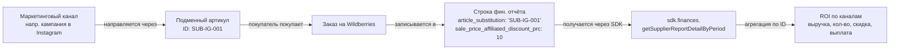

# Отслеживание рекламных каналов с помощью подменных артикулов

> **Сценарий использования**: Финансовая сверка. Ретроспективная атрибуция начисленной выручки к конкретным внешним маркетинговым кампаниям с помощью идентификаторов подменных артикулов из финансового отчёта Wildberries.

::: warning Эндпоинт v5 будет отключён 15.07.2026
Примеры ниже используют `getSupplierReportDetailByPeriod()` (v5), который Wildberries отключит **15.07.2026**. Для нового кода используйте замену v1 — `getSalesReportsDetailed()`, который возвращает те же данные по подменным артикулам (`articleSubstitution`, `salePriceAffiliatedDiscountPrc`) в camelCase со строковыми денежными суммами. Подробный маппинг полей и примеры кода см. в [руководстве по миграции v5→v1](/guides/migration-finance-reports-v5-to-v1).
:::
>
> **Не для**: Аналитики маркетинга в реальном времени. Если вам нужны метрики кампании в реальном времени, используйте данные поисковых запросов из модуля аналитики (параметр `includeSubstitutedSKUs` в `getSearchQueriesV3`) — это инструмент для маркетинговой команды. Данное руководство предназначено для финансовых команд, сопоставляющих маркетинговые расходы с фактически оплаченной выручкой *после* закрытия отчётного периода.

**Целевая аудитория**: Финансовые инженеры, разработчики BI-инструментов, операторы платформ, обслуживающие нескольких продавцов Wildberries.

**Требования**: SDK v3.6.0+, действующий API-ключ Wildberries с правами на статистику, Node.js >= 20.

**Примерное время прочтения**: 10 минут.

**Начиная с**: SDK v3.6.0 (апрель 2026)

---

## Что такое подменный артикул?

**Подменный артикул** (англ. *substitute article*) — это альтернативный идентификатор товара, который вы создаёте в личном кабинете продавца Wildberries в разделе *Рост продаж → Подменные артикулы*. Каждый подменный артикул указывает на один из ваших реальных товаров, но отображается покупателям под другим ID — при этом вы можете задать дополнительную скидку (3%–50%) сверх вашей текущей скидки продавца.

Подменные артикулы используются для **направления внешних маркетинговых кампаний через уникальные идентификаторы**. Вместо того чтобы из каждого поста в Instagram, статьи в блоге и коллаборации с инфлюенсером вести на один и тот же URL товара, вы создаёте отдельный подменный артикул для каждой кампании и привязываете каждую кампанию к своему ID. Когда покупатель в итоге совершает покупку, ID подменного артикула записывается в финансовый отчёт — и вы можете атрибутировать продажу (и скидку) конкретному маркетинговому каналу, который её привёл.

Эта функция была добавлена Wildberries **06.04.2026** ([новость id=11270](https://seller.wildberries.ru/news-v2/news-details?id=11270)).

## Как данные проходят через систему



SDK предоставляет поля `article_substitution` и `sale_price_affiliated_discount_prc` в типе `DetailReportItem` (добавлены в v3.6.0). Вы получаете отчёт, фильтруете строки, где использовался подменный артикул, группируете по ID и агрегируете.

---

## Поля SDK

После установки SDK v3.6.0+ следующие необязательные поля доступны в каждом объекте `DetailReportItem`, возвращаемом `sdk.finances.getSupplierReportDetailByPeriod()`:

| Поле | Тип | Описание |
|-------|------|-------------|
| `article_substitution` | `string` | ID подменного артикула. Пустая строка `""` означает, что подменный артикул не использовался для данной транзакции. |
| `sale_price_affiliated_discount_prc` | `number` | Применённая скидка подменного артикула в процентах (например, `10` для 10%). |
| `sale_price_wholesale_discount_prc` | `number` | Скидка для оптовых покупателей в процентах. В настоящее время всегда `0`, пока WB не запустит инструмент прогрессивной оптовой скидки — см. [новость id=11226](https://seller.wildberries.ru/news-v2/news-details?id=11226). |
| `agency_vat` | `number` | НДС агента. Семантика не документирована WB по состоянию на 08.04.2026; уточняйте у WB перед использованием. |

## Промышленный паттерн агрегации

Пример ниже намеренно написан для работы в реальном масштабе — несколько подменных артикулов, тысячи строк отчёта и пустое состояние. В нём используется **inline `reduce`** для агрегации вместо `Object.groupBy()`, поскольку SDK поддерживает Node 20 (где `Object.groupBy()` недоступен).

```typescript
import { WildberriesSDK } from 'daytona-wildberries-typescript-sdk';
import type { DetailReportItem } from 'daytona-wildberries-typescript-sdk/finances';

interface ChannelAggregate {
  substituteArticleId: string;
  totalRevenueRub: number;
  totalQuantity: number;
  totalPayoutRub: number;
  averageDiscountPercent: number;
  orderCount: number;
}

async function reconcileSubstituteArticles(
  sdk: WildberriesSDK,
  dateFrom: string,
  dateTo: string
): Promise<ChannelAggregate[]> {
  // 1. Получаем все строки детализации за период
  const rows: DetailReportItem[] = await sdk.finances.getSupplierReportDetailByPeriod({
    dateFrom,
    dateTo,
    period: 'weekly',
  });

  // 2. Фильтруем строки, пришедшие через подменный артикул
  const substituteRows = rows.filter(
    (row) => row.article_substitution != null && row.article_substitution !== ''
  );

  // 3. Явно обрабатываем пустое состояние, чтобы потребители не подумали, что SDK сломан
  if (substituteRows.length === 0) {
    console.log(
      `Транзакций с подменными артикулами не найдено за период ${dateFrom} — ${dateTo}. ` +
        'Это ожидаемо, если в данном периоде не проводились маркетинговые кампании через подменные артикулы.'
    );
    return [];
  }

  // 4. Группируем по ID подменного артикула с помощью inline reduce (совместимо с Node 20)
  type Bucket = {
    revenueSum: number;
    quantitySum: number;
    payoutSum: number;
    discountSum: number;
    count: number;
  };

  const buckets = substituteRows.reduce<Record<string, Bucket>>((acc, row) => {
    const key = row.article_substitution!;
    if (!acc[key]) {
      acc[key] = { revenueSum: 0, quantitySum: 0, payoutSum: 0, discountSum: 0, count: 0 };
    }
    acc[key].revenueSum += row.retail_amount ?? 0;
    acc[key].quantitySum += row.quantity ?? 0;
    acc[key].payoutSum += row.ppvz_for_pay ?? 0;
    acc[key].discountSum += row.sale_price_affiliated_discount_prc ?? 0;
    acc[key].count += 1;
    return acc;
  }, {});

  // 5. Преобразуем бакеты в отсортированный список агрегатов
  return Object.entries(buckets)
    .map(([id, bucket]) => ({
      substituteArticleId: id,
      totalRevenueRub: bucket.revenueSum,
      totalQuantity: bucket.quantitySum,
      totalPayoutRub: bucket.payoutSum,
      averageDiscountPercent: bucket.discountSum / bucket.count,
      orderCount: bucket.count,
    }))
    .sort((a, b) => b.totalRevenueRub - a.totalRevenueRub);
}

// Использование
const sdk = new WildberriesSDK({ apiKey: process.env.WB_API_KEY! });
const channels = await reconcileSubstituteArticles(sdk, '2026-04-01', '2026-04-30');

console.table(channels);
// ┌─────────┬──────────────────────┬────────────────┬──────────────┬──────────────┬─────────────────────────┬──────────────┐
// │ (index) │ substituteArticleId  │ totalRevenueRub│ totalQuantity│ totalPayoutRub│ averageDiscountPercent  │  orderCount  │
// ├─────────┼──────────────────────┼────────────────┼──────────────┼──────────────┼─────────────────────────┼──────────────┤
// │    0    │   'SUB-IG-001'       │     54_300     │      36      │    46_155    │           10            │      36      │
// │    1    │   'SUB-BLOG-002'     │     21_800     │      14      │    18_530    │            5            │      14      │
// │    2    │   'SUB-INFLUENCER-3' │      8_900     │       6      │     7_565    │           15            │       6      │
// └─────────┴──────────────────────┴────────────────┴──────────────┴──────────────┴─────────────────────────┴──────────────┘
```

## Сопоставление ID подменных артикулов с маркетинговыми каналами

SDK возвращает необработанный ID подменного артикула. Сопоставление этого ID с человекочитаемым названием маркетингового канала выполняется **за пределами SDK** — обычно это небольшая таблица соответствий, которую вы ведёте вместе с записями о кампаниях:

```typescript
const channelLabels: Record<string, string> = {
  'SUB-IG-001': 'Instagram — кампания весенней коллекции, апрель',
  'SUB-BLOG-002': 'Обзор в техноблоге — 28 марта',
  'SUB-INFLUENCER-3': 'Коллаборация с инфлюенсером — Анна К.',
};

const labeled = channels.map((c) => ({
  ...c,
  channel: channelLabels[c.substituteArticleId] ?? '(не сопоставлено)',
}));
```

При создании подменного артикула в личном кабинете продавца одновременно записывайте как ID, так и метаданные кампании в вашу собственную систему. SDK не имеет доступа к вашей системе управления кампаниями, поэтому это сопоставление — ваша ответственность.

## Дополнительные источники данных

**Для отслеживания маркетинга в реальном времени** (во время кампании, а не после закрытия периода) используйте эндпоинты поисковых отчётов модуля аналитики. Они принимают параметр `includeSubstitutedSKUs`, и элементы ответа содержат булево поле `IsSubstitutedSKU`, указывающее, прошёл ли поисковый запрос через подменный артикул:

```typescript
// Реальное время: создаём задачу поискового отчёта, затем опрашиваем результаты
await sdk.analytics.createSearchReportReport({
  // ... ваши параметры, включая:
  // includeSubstitutedSKUs: true,
  // includeSearchTexts: true,
});
```

Доступные методы аналитики, поддерживающие фильтрацию по подменным артикулам: `createSearchReportReport`, `createSearchReportTableGroups`, `createSearchReportTableDetails`. Полный рабочий процесс см. в [руководстве по аналитике поисковых запросов](/guides/search-queries-analytics).

Эти два представления предназначены для разных аудиторий:

| Представление | Модуль | Сценарий | Аудитория |
|------|--------|----------|----------|
| Телеметрия поисковых запросов | `analytics` (начиная с v3.4.0) | Нашли ли покупатели товар через подменный артикул? | Маркетинговая команда, реальное время |
| Атрибуция продаж | `finances` (данное руководство, начиная с v3.6.0) | Какие продажи пришли через какой подменный артикул? | Финансовая команда, после закрытия периода |

## Ограничения

- **Отключение подменного артикула**: Wildberries позволяет продавцам отключать подменные артикулы, и после отключения их нельзя включить заново. Сохраняется ли поле `article_substitution` в **исторических** финансовых отчётах после отключения — пока не подтверждено. Предполагайте, что данные сохраняются (типичное поведение архивации Wildberries), но проверьте, прежде чем полагаться на это для долгосрочного анализа.
- **Нет API для управления**: По состоянию на 08.04.2026 публичного API Wildberries для создания, просмотра или отключения подменных артикулов не существует. Это необходимо делать в личном кабинете продавца в разделе *Рост продаж → Подменные артикулы*. SDK предоставляет данные, поступающие в финансовый отчёт; он не управляет подменными артикулами как таковыми.
- **Семантика `agency_vat` не документирована**: Поле `agency_vat` присутствует в ответе API, но не описано ни в одной новости WB и ни в локальной спецификации OpenAPI. Уточните у WB перед использованием.
- **Поле оптовой скидки возвращает 0**: `sale_price_wholesale_discount_prc` в настоящее время всегда равно `0`. Оно начнёт заполняться после запуска Wildberries инструмента прогрессивной оптовой скидки — см. [новость id=11226](https://seller.wildberries.ru/news-v2/news-details?id=11226).

## Лимиты запросов

`getSupplierReportDetailByPeriod` имеет лимит **1 запрос в минуту на аккаунт продавца**. Для пакетных задач сверки добавляйте соответствующие задержки или полагайтесь на встроенный ограничитель запросов SDK (он автоматически ставит запросы в очередь).

## Связанные ресурсы

- [Миграция финансовых отчётов v5 → v1](/ru/guides/migration-finance-reports-v5-to-v1) — полное сопоставление полей (snake_case v5 → camelCase v1), использование `parseMoneyAmount` и примеры замены. Примеры в данном руководстве используют устаревший endpoint v5; руководство по миграции показывает эквиваленты для v1.
- Новость WB (подменные артикулы, 06.04.2026): https://seller.wildberries.ru/news-v2/news-details?id=11270
- Новость WB (оптовая скидка, 02.04.2026): https://seller.wildberries.ru/news-v2/news-details?id=11226
- Документация WB API: https://dev.wildberries.ru/docs/openapi/financial-reports-and-accounting#tag/Finansovye-otchyoty/paths/~1api~1v5~1supplier~1reportDetailByPeriod/get
- Справочник модуля финансов SDK: [/api/classes/FinancesModule](/api/classes/FinancesModule)
- Аналитика поисковых запросов SDK (дополнительно): [Аналитика поисковых запросов](/ru/guides/search-queries-analytics)

---

> **🌐 Данная страница является русской версией руководства.** Оригинал на английском языке: [Tracking Promotion Channels with Substitute Articles](/guides/tracking-promotion-channels-with-substitute-articles).
